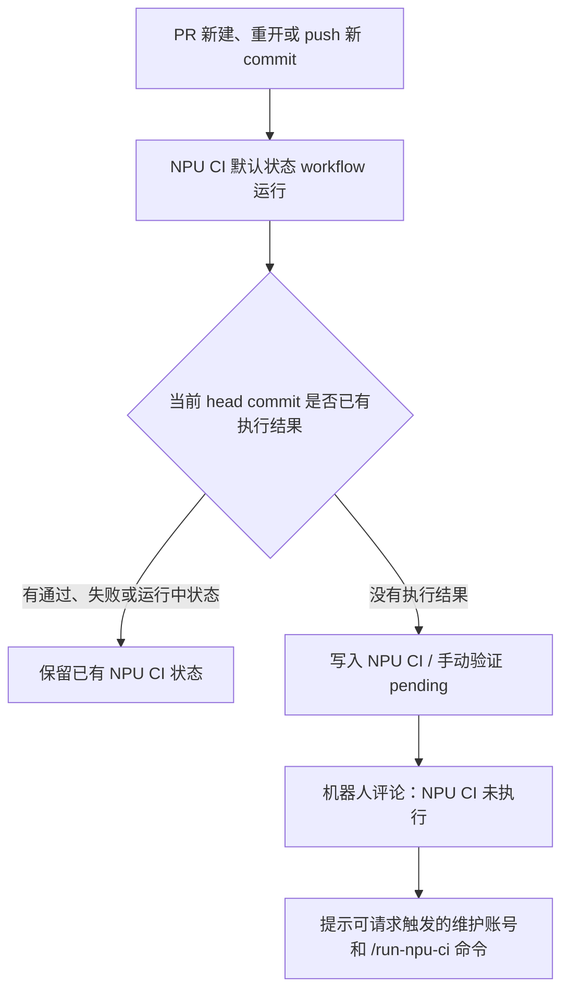
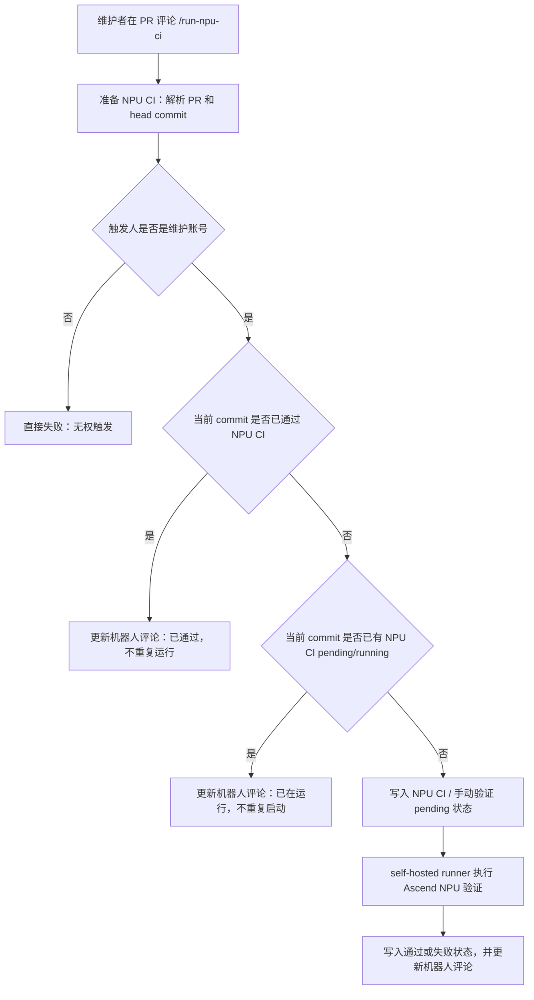
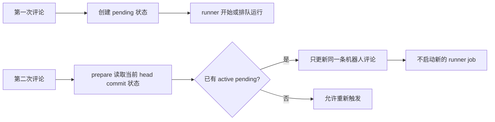
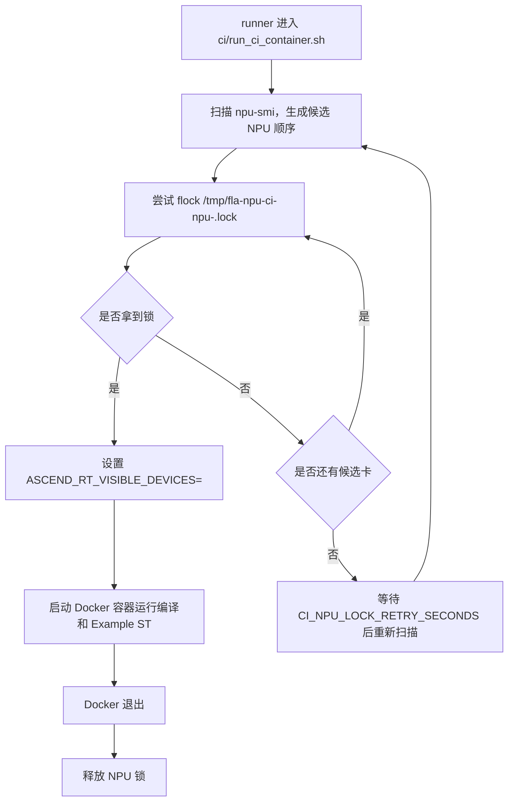

# NPU CI 部署教程

本文面向第一次接触 GitHub Actions self-hosted runner 的维护者，目标是在一台带 Ascend NPU 的服务器上部署本仓库的手动 NPU CI。

示例服务器路径使用 `/workspace/flash-linear-attention-npu-ci`。示例仓库地址使用 `https://github.com/flashserve/flash-linear-attention-npu`。

## 先看重点

下面这些点最容易踩坑，建议先读完再操作。

1. **Docker 容器必须带 `--privileged`。**
   本仓 `ci/run_ci_container.sh` 默认已经启用 `CI_DOCKER_PRIVILEGED=true`，最终会执行带 `--privileged` 的 `docker run`。如果没有它，容器里常见现象是 `npu-smi` 不可用，或者 `torch_npu.npu.device_count()` 返回 `0`。

2. **宿主机物理 NPU 和容器内逻辑 NPU 不是同一个编号。**
   脚本会在宿主机上自动选择一张物理卡，例如 `ASCEND_RT_VISIBLE_DEVICES=2`。进入容器后，这张卡通常映射成逻辑设备 `0`。所以 CI 中传给 PyTorch example 的设备号默认是 `CI_CONTAINER_DEVICE=0`。

3. **Example ST 必跑，而且不改用例原始 shape。**
   CI 固定执行 `examples/flash_gated_delta_rule.py`。默认不传 `--tokens`、`--heads`、`--dim`、`--value-dim` 等 shape 参数，只额外传容器内逻辑设备号 `--device 0`。

4. **Ascend PyTorch 必须使用 `v26.1.0-beta.1` release family。**
   该 release 修复了 GDN 自定义适配中 `aclnn_extension` 未传 stream 导致算子间数据同步不生效的问题。镜像中直接安装 GitCode release 页面提供的 `torch_npu` wheel，该 wheel 已包含 `torchnpugen`，不要再拉 `op-plugin` 仓库重新编译。

5. **`triton-ascend` 和社区版 `triton` 不要共存。**
   镜像会安装 `triton-ascend==3.2.0`，并清理社区版 `triton`。如果容器里又装了社区版 `triton`，可能出现 `torch_npu`/`triton` namespace 重复注册问题。

6. **runner registration token 很短时效，且只能由 GitHub 管理员生成。**
   如果下载 runner 很慢，token 可能在真正注册前过期。过期后回到 GitHub 页面重新生成一个 token，再重新执行注册脚本即可。

7. **runner 标签必须和 workflow 完全匹配。**
   本仓 workflow 使用 `runs-on: [self-hosted, linux, arm64, npu, flash-linear-attention-npu]`。注册 runner 时需要带 `linux,arm64,npu,flash-linear-attention-npu` 这些标签，否则 workflow 会一直排队。

8. **NPU CI 不会因为 PR 新建、重新打开、push 新 commit 自动执行。**
   PR 新建、重新打开、push 新 commit 后，会自动出现 `NPU CI / 手动验证 pending`，描述为“未执行”，用于阻止未验证 commit 合入。真正执行 NPU CI 仍需要维护者点击 GitHub Actions 按钮，或在 PR 评论里发送 `/run-npu-ci quick` / `/run-npu-ci full` 触发。PR 更新 commit 后，旧 commit 上的 CI 成功状态不会再满足合入门禁。

9. **分支保护里的状态检查名称要完全一致。**
   必需状态检查是 `仓库规则 / 维护者检视门禁` commit status 和 `NPU CI / 手动验证`。名字写错、大小写不同、空格不同，GitHub 都会认为没有通过。

10. **`weinachuan` 强行合入 bypass 不是写在代码里自动生效的。**
    需要 GitHub 管理员用 `scripts/github/apply_branch_protection.sh` 应用到 GitHub 分支保护规则。

11. **多个 NPU CI 同时触发时有两层保护。**
    同一 PR 的同一 head commit 如果已经有 `NPU CI / 手动验证` 处于 pending/running，重复评论只会更新机器人评论为“已在运行”，不会再次占用 NPU。runner 宿主机上还会用 `/tmp/fla-npu-ci-npu-<id>.lock` 对物理 NPU 加锁，避免多个 runner 抢同一张卡。

12. **CI 容器内日志默认只保留 7 天。**
    每次 NPU CI 容器启动时都会执行 `ci/cleanup_ci_logs.sh`，删除超过 7 天的 CI/Ascend/NPU 日志。这个策略只管理 CI 容器和仓库工作目录里的日志，不等同于 GitHub Actions 网页日志保留时间。

## 流程图

PR 新建或更新默认状态流程：



评论触发总流程：



同一 PR + 同一 commit 重复触发流程：



runner 宿主机 NPU 加锁流程：



## 你需要准备什么

- 一台可 SSH 登录的 Ascend NPU 服务器，例如 `<npu-ci-host>`
- 服务器是 Linux/aarch64，已安装 Ascend 驱动，宿主机能执行 `npu-smi info`
- 服务器已安装 Docker，并且当前用户可以执行 `docker`
- GitHub 仓库管理员权限
- 一个能访问 GitHub 的网络环境
- 本仓库代码
- CI Docker 镜像，推荐使用已经打包好的 `fla-npu-ci:8.5.0-910b` 镜像

## 第 1 步：登录服务器并准备目录

```sh
ssh <npu-ci-host>
```

创建 CI 工作目录：

```sh
mkdir -p /workspace/flash-linear-attention-npu-ci
cd /workspace/flash-linear-attention-npu-ci
```

如果普通用户没有权限创建 `/workspace`，请让服务器管理员创建目录，或使用：

```sh
sudo mkdir -p /workspace/flash-linear-attention-npu-ci
sudo chown -R "$USER":"$USER" /workspace/flash-linear-attention-npu-ci
```

## 第 2 步：放置本仓库代码

有 GitHub 访问权限时，直接 clone：

```sh
cd /workspace/flash-linear-attention-npu-ci
git clone https://github.com/flashserve/flash-linear-attention-npu.git context
cd context
git checkout main
```

如果服务器不能访问 GitHub，也可以从一台能访问 GitHub 的机器把仓库目录同步到：

```text
/workspace/flash-linear-attention-npu-ci/context
```

确认关键脚本存在：

```sh
ls ci/run_ci_container.sh ci/setup_self_hosted_runner.sh ci/detect_npu.sh
```

## 第 3 步：检查宿主机 NPU

先确认宿主机能看到 NPU：

```sh
npu-smi info
```

再用本仓脚本检查自动选卡结果：

```sh
cd /workspace/flash-linear-attention-npu-ci/context
bash ci/detect_npu.sh --summary
```

你应该能看到类似输出：

```text
Detected NPU devices:
  - id=0 name=910B3 health=OK free=0 soc=ascend910b
  - id=2 name=910B3 health=Alarm free=1 soc=ascend910b
Selected NPU: id=2 name=910B3 health=Alarm free=1 soc=ascend910b
```

`health=Alarm` 不一定会阻止 CI，因为默认 `CI_REQUIRE_HEALTHY_NPU=false`。如果你希望只允许健康卡运行，可以在 runner 环境里设置 `CI_REQUIRE_HEALTHY_NPU=true`。

查看 runner 会按什么顺序尝试加锁：

```sh
bash ci/detect_npu.sh --candidates
```

CI 会优先尝试健康且空闲的 NPU，然后尝试空闲但健康状态异常的 NPU。真正占用前还会拿 `/tmp/fla-npu-ci-npu-<id>.lock` 文件锁，拿不到锁时会继续尝试下一张卡。

## 第 4 步：准备 Docker 镜像

推荐使用已经打包好的镜像。假设镜像包在服务器上：

```text
/workspace/fla-npu-ci-8.5.0-910b.tar
```

加载镜像：

```sh
docker load -i /workspace/fla-npu-ci-8.5.0-910b.tar
docker image inspect fla-npu-ci:8.5.0-910b >/dev/null
```

如果镜像 tag 不是 `fla-npu-ci:8.5.0-910b`，请重新打 tag：

```sh
docker images
docker tag <IMAGE_ID_OR_OLD_TAG> fla-npu-ci:8.5.0-910b
```

如果没有打包镜像，也可以从仓库 Dockerfile 构建：

```sh
cd /workspace/flash-linear-attention-npu-ci/context
docker build -t fla-npu-ci:8.5.0-910b -f ci/Dockerfile .
```

镜像默认安装：

- `torch==2.7.1`
- Ascend PyTorch `v26.1.0-beta.1-pytorch2.7.1` 对应的 `torch_npu-2.7.1.post5` wheel
- `triton-ascend==3.2.0`
- `pybind11`
- 预烘的 `third_party` 依赖种子

如需切换 PyTorch 小版本，可以通过 Docker build args 覆盖，但 `TORCH_NPU_RELEASE_TAG` 必须属于 `v26.1.0-beta.1` release family，且 wheel 要匹配 Python 和 PyTorch 版本。

## 第 5 步：验证容器能看到 NPU

先跑一个轻量检查。这里重点验证 `--privileged`、驱动挂载和容器内逻辑设备号：

```sh
cd /workspace/flash-linear-attention-npu-ci/context

eval "$(bash ci/detect_npu.sh --env)"

mount_args=()
for path in \
  /usr/local/dcmi \
  /usr/local/bin/npu-smi \
  /usr/local/Ascend/driver/lib64 \
  /usr/local/Ascend/driver/version.info \
  /etc/ascend_install.info; do
  if [ -e "$path" ]; then
    mount_args+=(-v "$path:$path")
  fi
done

docker run --rm \
  --privileged \
  --network host \
  --ipc host \
  "${mount_args[@]}" \
  -e ASCEND_RT_VISIBLE_DEVICES="$NPU_SELECTED_DEVICE" \
  fla-npu-ci:8.5.0-910b \
  bash -lc 'npu-smi info && python3 - <<PY
import torch
import torch_npu
print("torch:", torch.__version__)
print("torch_npu device_count:", torch_npu.npu.device_count())
PY'
```

期望看到：

```text
torch_npu device_count: 1
```

如果这里是 `0`，优先检查：

- 命令里是否有 `--privileged`
- 宿主机 `npu-smi info` 是否正常
- `/usr/local/Ascend/driver/lib64`、`/usr/local/bin/npu-smi` 等路径是否存在
- `ASCEND_RT_VISIBLE_DEVICES` 是否选到了真实存在的 NPU

然后跑本仓 CI 入口做一次端到端检查：

```sh
cd /workspace/flash-linear-attention-npu-ci/context
CI_MODE=quick CI_RUN_EXAMPLE_ST=true bash ci/run_ci_container.sh
```

这个命令会：

- 自动扫描宿主机 NPU
- 用 `--privileged` 启动容器
- 挂载 `third_party` 缓存
- 编译整包
- 安装 `.run` 自定义 OPP 包
- 编译并安装 `torch_custom/fla_npu`
- 执行 `examples/flash_gated_delta_rule.py`，保持用例原始 shape，仅覆盖 `--device 0`

## 第 6 步：生成 self-hosted runner token

这一步必须由 GitHub 仓库管理员操作。

1. 打开仓库页面：`https://github.com/flashserve/flash-linear-attention-npu`
2. 点击顶部 `Settings`
3. 左侧点击 `Actions`
4. 点击 `Runners`
5. 点击 `New self-hosted runner`
6. 选择操作系统 `Linux`
7. 选择架构 `ARM64`
8. 页面会显示一段安装命令，其中有一个 `--token xxxxxxxxx`，复制这个 token

不要把 token 发到公开聊天、PR、Issue 或日志里。它过期后重新生成即可。

## 第 7 步：注册 runner

回到 NPU 服务器执行：

```sh
cd /workspace/flash-linear-attention-npu-ci/context

bash ci/setup_self_hosted_runner.sh \
  --url https://github.com/flashserve/flash-linear-attention-npu \
  --token <把刚才复制的 registration token 放这里>
```

脚本默认会把 runner 安装到：

```text
/workspace/actions-runner/flash-linear-attention-npu
```

默认 runner name 是：

```text
<hostname>-flash-linear-attention-npu
```

默认 labels 是：

```text
linux,arm64,npu,flash-linear-attention-npu
```

如果脚本用 root 运行，会尝试安装并启动系统服务。完成后回到 GitHub 页面：

```text
Settings -> Actions -> Runners
```

确认 runner 状态是绿色 `Idle` 或 `Online`。

## 第 8 步：runner 没变绿怎么查

先在服务器上看 runner 目录：

```sh
cd /workspace/actions-runner/flash-linear-attention-npu
ls
```

如果已经安装成服务：

```sh
sudo ./svc.sh status
```

尝试重启：

```sh
sudo ./svc.sh stop
sudo ./svc.sh start
sudo ./svc.sh status
```

查看日志：

```sh
journalctl -u 'actions.runner.*' -n 200 --no-pager
```

如果没有安装服务，可以前台运行看日志：

```sh
cd /workspace/actions-runner/flash-linear-attention-npu
./run.sh
```

常见原因：

- registration token 过期：回到 GitHub 重新生成 token，再执行 `ci/setup_self_hosted_runner.sh`
- runner 下载太慢：等下载完成后重新生成 token，再执行注册
- labels 不匹配：重新注册时设置 `RUNNER_LABELS=linux,arm64,npu,flash-linear-attention-npu`
- 服务器不能访问 GitHub：检查 DNS、代理、防火墙
- runner 已注册但离线：重启 runner 服务

重新注册示例：

```sh
cd /workspace/flash-linear-attention-npu-ci/context

RUNNER_LABELS=linux,arm64,npu,flash-linear-attention-npu \
bash ci/setup_self_hosted_runner.sh \
  --url https://github.com/flashserve/flash-linear-attention-npu \
  --token <新的 registration token>
```

脚本会使用 `--replace` 替换同名 runner。

## 第 9 步：配置分支保护和 weinachuan bypass

这一步也需要 GitHub 仓库管理员权限。

推荐使用脚本应用分支保护：

```sh
cd /workspace/flash-linear-attention-npu-ci/context

export GITHUB_TOKEN=<具有仓库 Administration 写权限的 GitHub token>
bash scripts/github/apply_branch_protection.sh main
```

这个脚本会给 `main` 配置：

- 必需状态检查：`仓库规则 / 维护者检视门禁` commit status
- 必需状态检查：`NPU CI / 手动验证`
- PR 至少 2 个 approval
- 需要 CODEOWNERS review
- push 新 commit 后旧 review 失效
- 需要最后一次 push 不是由审批人自己完成
- `weinachuan` 具备 PR bypass allowance
- 禁止 force push
- 禁止删除分支

如果你要手动在 GitHub 页面配置：

1. 打开仓库 `Settings`
2. 左侧点击 `Branches`
3. 找到 `Branch protection rules`
4. 编辑或新建保护规则，Branch name pattern 填 `main`
5. 勾选 `Require a pull request before merging`
6. Required approvals 填 `2`
7. 勾选 `Require review from Code Owners`
8. 勾选 `Dismiss stale pull request approvals when new commits are pushed`
9. 勾选 `Require approval of the most recent reviewable push`
10. 勾选 `Require status checks to pass before merging`
11. 勾选 `Require branches to be up to date before merging`
12. 添加必需检查 `仓库规则 / 维护者检视门禁` commit status
13. 添加必需检查 `NPU CI / 手动验证`
14. 在 bypass 或 pull request bypass allowance 中添加用户 `weinachuan`
15. 保存规则

如果 GitHub 页面里搜不到某个 status check，通常是因为该 check 还没有在仓库里跑过。可以先让 workflow 或状态检查执行一次，或者直接用脚本通过 API 设置。

## 第 10 步：验证触发方式

本仓 NPU CI 不会被 PR 自动执行。PR 新建、重开或 push 新 commit 时，GitHub 会自动给当前 head commit 写入 `NPU CI / 手动验证 pending`，描述为“未执行”。这个状态会出现在 PR checks 中，用来提醒该 commit 还没有完成 NPU CI。

如果 PR push 了新 commit，默认状态会重新写到新的 head commit 上，描述为“commit 已变化，请重新触发”。旧 commit 的 NPU CI success 不会给新 commit 使用。

机器人也会在 PR 评论区写入或更新一条提示，列出可以请求触发的维护账号，以及 `/run-npu-ci quick` / `/run-npu-ci full` 命令。

维护者可以用两种方式手动触发真正的 NPU CI。

触发后，GitHub 机器人会在 PR 评论区写入一条 NPU CI 状态评论。刚触发时显示“已开始”，执行完成后同一条评论会更新为“通过”或“失败”。如果 Actions 页面能看到 workflow 已触发，但 PR 下没有机器人评论，先检查下面两项：

1. 打开仓库 `Settings -> Actions -> General`，在 `Workflow permissions` 中选择 `Read and write permissions`，保存。
2. 如果组织或仓库策略不允许打开默认写权限，请创建一个名为 `NPU_CI_BOT_TOKEN` 的仓库 secret。这个 token 至少需要能读 PR、写 issue comment、写 commit status。workflow 会优先使用 `NPU_CI_BOT_TOKEN`，没有配置时才使用默认 `GITHUB_TOKEN`。

方式一：GitHub Actions 按钮。

1. 打开仓库 `Actions`
2. 选择左侧 `NPU CI`
3. 点击右侧 `Run workflow`
4. 填写：
   - `pr_number`: PR 编号，例如 `23`
   - `ci_mode`: `quick` 或 `full`
   - `ops`: 可选，逗号分隔的算子列表
   - `example_args`: 可选，默认留空，留空时保持 `examples/flash_gated_delta_rule.py` 原始 shape；通常不要填写，除非维护者明确要求追加已批准的泛化场景参数
5. 点击绿色 `Run workflow`

方式二：在 PR 评论区发送命令。

```text
/run-npu-ci
/run-npu-ci quick
/run-npu-ci full
/run-npu-ci quick ops=causal_conv1d,chunk_bwd_dv_local
```

只有维护账号可以触发：

- `juyangokok`
- `weinachuan`
- `weiwei-612`
- `woey`
- `zhangshuolei-hfut`
- `chen-linxin`

PR 新建或 push 新 commit 后，当前 head commit 会先出现默认状态：

```text
NPU CI / 手动验证 pending
未执行：请维护者评论 /run-npu-ci quick
```

如果是 push 新 commit，默认状态会显示：

```text
NPU CI / 手动验证 pending
未执行：commit 已变化，请重新触发 /run-npu-ci quick
```

维护者触发执行后，仍会保持 pending，但描述会变成类似：

```text
NPU CI / 手动验证 pending
NPU CI 已由 @weinachuan 触发 (quick+example)
```

成功后会变成：

```text
NPU CI / 手动验证 success
```

PR 评论区也会出现或更新一条机器人评论，包含触发人、模式、Example ST 要求和 Actions run 链接。

如果当前 head commit 已经成功跑过带 Example ST 的 NPU CI，重复触发会跳过，不再占用 NPU。

如果当前 head commit 已经有 NPU CI 处于排队或运行中，重复评论也会跳过，不会再启动新的 self-hosted runner job。机器人评论会更新为“已在运行”，并指向已有 Actions run。

不同 PR 或不同 commit 的 NPU CI 可以同时被触发。真正到 runner 宿主机执行时，`ci/run_ci_container.sh` 会为选中的物理 NPU 加文件锁，默认锁文件是 `/tmp/fla-npu-ci-npu-<id>.lock`。如果所有候选 NPU 都被锁住，job 会等待并重试。

锁相关环境变量：

| 变量 | 默认值 | 说明 |
| --- | --- | --- |
| `CI_NPU_LOCK_DIR` | `/tmp` | NPU 锁文件所在目录 |
| `CI_NPU_LOCK_WAIT_SECONDS` | `14400` | 等待空闲 NPU 锁的最长时间，`0` 表示一直等待 |
| `CI_NPU_LOCK_RETRY_SECONDS` | `10` | 所有 NPU 都被锁住时的重试间隔 |

日志清理相关环境变量：

| 变量 | 默认值 | 说明 |
| --- | --- | --- |
| `CI_LOG_CLEANUP_ENABLED` | `true` | 是否在 CI 容器启动时清理历史日志 |
| `CI_LOG_RETENTION_DAYS` | `7` | 仅保留最近多少天的日志 |
| `CI_LOG_CLEANUP_DIRS` | 空 | 额外清理目录，多个目录用 `:` 分隔 |

默认会清理这些目录中超过保留天数的文件：仓库内 `log/`、`logs/`、`log_ut/`、`output/log*/`、`build/log*/`、`build_out/log*/`，以及容器内常见的 Ascend/NPU 日志目录。

## 第 11 步：合入前怎么判断是否满足门禁

合入 PR 前确认三件事：

1. 当前 head commit 上 `NPU CI / 手动验证` 是 success
2. 当前 head commit 上 `仓库规则 / 维护者检视门禁` commit status 是 success
3. 维护账号列表中至少 2 个账号完成 approval

如果 PR 又 push 了新 commit，需要重新跑 NPU CI。旧 commit 的成功结果不能给新 commit 使用。

`weinachuan` 如果需要紧急强行合入，可以走 GitHub branch protection bypass，但前提是第 9 步已经把 bypass allowance 配好。

## 第 12 步：常见问题

### Actions 页面显示 queued，不开始跑

优先检查：

- runner 是否绿色 `Idle` 或 `Online`
- runner labels 是否包含 `linux,arm64,npu,flash-linear-attention-npu`
- workflow 的 `runs-on` 是否被改过
- runner 服务是否在运行

### Runner 页面没有绿色状态

优先检查：

- registration token 是否过期
- `setup_self_hosted_runner.sh` 是否执行到 `./config.sh`
- 服务器是否能访问 `github.com`
- runner 服务是否启动成功

### 容器里看不到 NPU

优先检查：

- `CI_DOCKER_PRIVILEGED` 是否是 `true`
- `docker run` 日志里是否有 `--privileged`
- 宿主机 `npu-smi info` 是否正常
- 容器内 `torch_npu.npu.device_count()` 是否为 `1`
- 是否把宿主机物理设备号当成容器内逻辑设备号使用。容器内通常应使用 `--device 0`

### 报 `Invalid device ID`

通常是容器内传了宿主机物理卡号。例如宿主机选择了卡 `2`，容器里应该传 `--device 0`，不要传 `--device 2`。

### 报 `torchnpugen` 缺失

说明镜像里的 `torch_npu` 不对。请确认使用的是 Ascend PyTorch `v26.1.0-beta.1` release family 的 GitCode wheel，不要安装 PyPI 上不匹配的旧 `torch-npu`，也不要重新拉 `op-plugin` 编译。

### 报 `triton` namespace 或重复注册问题

检查是否同时安装了社区版 `triton` 和 `triton-ascend`。本仓 CI 镜像只保留 `triton-ascend==3.2.0` 提供的 `triton` 模块。

### `.run` 安装后 Python 调用找不到自定义 op

检查日志里是否设置了 custom OPP 的 op_api lib：

```text
Custom OPP op_api lib: /usr/local/Ascend/.../opp/vendors/fla_npu_transformer/op_api/lib
```

如果没有，需要确认 `.run` 包安装成功，并且 `LD_LIBRARY_PATH` 包含这个目录。

### 评论触发没有反应

检查：

- 评论是否发在 PR 页面，不是普通 Issue 页面
- 命令是否以 `/run-npu-ci` 开头
- 发送评论的人是否在维护账号列表中
- workflow 是否启用
- Actions 页面是否出现新的 `NPU CI` run

### PR 创建后没有 `NPU CI / 手动验证` 未执行状态

检查：

- `NPU CI 默认状态` workflow 是否启用
- PR 是否是新建、重开、ready for review，或刚 push 了新 commit
- workflow 是否有 `statuses: write` 权限
- 如果默认 `GITHUB_TOKEN` 没有写权限，是否已经配置仓库 secret `NPU_CI_BOT_TOKEN`
- Actions 页面是否出现新的 `NPU CI 默认状态` run

### Actions 已触发，但 PR 下没有机器人评论

检查：

- `Settings -> Actions -> General -> Workflow permissions` 是否是 `Read and write permissions`
- 如果仓库不能开启默认写权限，是否已经配置仓库 secret `NPU_CI_BOT_TOKEN`
- `NPU_CI_BOT_TOKEN` 是否至少具备 PR 读取、issue comment 写入、commit status 写入权限
- workflow 日志里是否还有 `Resource not accessible by integration`

### PR 已合入但 Checks 历史里还有红色失败记录

旧版 `仓库规则 / 维护者检视门禁` 会在审批不足时让 Actions job 失败，GitHub 会保留这些历史 check run。新版 workflow 改为写 commit status：审批不足显示 `pending`，审批满足后显示 `success`，不会再因为等待审批留下红色失败记录。

已经产生的历史红色 check run 不能被后续 commit status 覆盖删除。若必须清理旧记录，需要仓库管理员在 GitHub `Actions` 页面删除对应的旧 workflow run，或使用 GitHub API 删除旧 run。

### 多个 NPU CI 同时触发怎么办

同一 PR 的同一 head commit 如果已经有 NPU CI 在排队或运行，重复评论只会更新机器人评论，不会再启动新任务。

不同 PR 或不同 commit 同时触发时，GitHub Actions 可能把它们分配给不同 self-hosted runner。runner 宿主机会用 `flock` 给物理 NPU 加锁，避免多个任务抢同一张卡。默认锁文件如下：

```text
/tmp/fla-npu-ci-npu-0.lock
/tmp/fla-npu-ci-npu-1.lock
```

如果所有候选 NPU 都被锁住，job 会输出：

```text
[CI] All detected NPU devices are locked; retrying in 10s.
```

这不是失败，表示正在等待其他 NPU CI 释放卡。如果等待超过 `CI_NPU_LOCK_WAIT_SECONDS`，job 才会失败。

### CI 容器日志怎么保留

CI 容器启动时会自动执行：

```sh
bash ci/cleanup_ci_logs.sh
```

默认只保留 7 天内的日志。需要调整时，在 runner 环境或 workflow 环境变量里设置：

```sh
export CI_LOG_RETENTION_DAYS=7
```

如果某次排障需要临时保留所有容器内日志，可以设置：

```sh
export CI_LOG_CLEANUP_ENABLED=false
```

注意：GitHub Actions 网页上的 run 日志保留时间由 GitHub 仓库或组织设置控制，不受 `ci/cleanup_ci_logs.sh` 影响。

## 参考链接

- GitHub self-hosted runners 文档：<https://docs.github.com/actions/hosting-your-own-runners/managing-self-hosted-runners/adding-self-hosted-runners>
- GitHub branch protection 文档：<https://docs.github.com/repositories/configuring-branches-and-merges-in-your-repository/managing-protected-branches>
- GitHub `GITHUB_TOKEN` 权限文档：<https://docs.github.com/actions/security-for-github-actions/security-guides/automatic-token-authentication>
