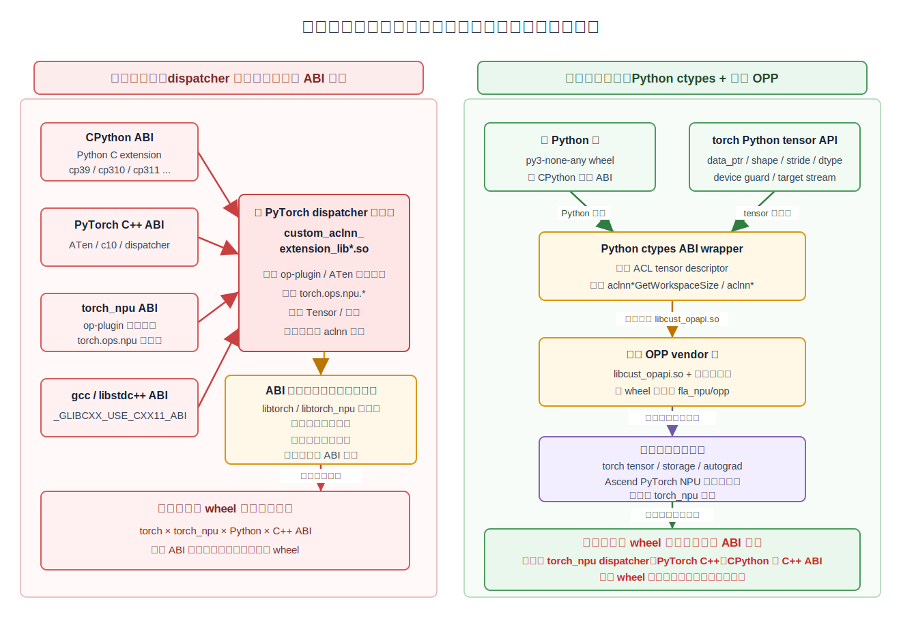
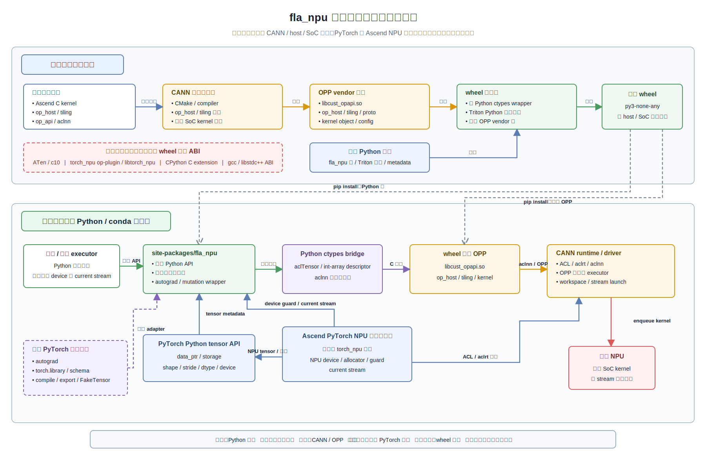
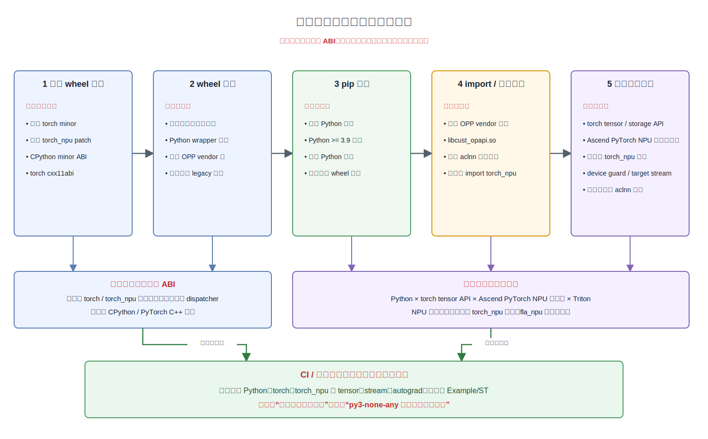
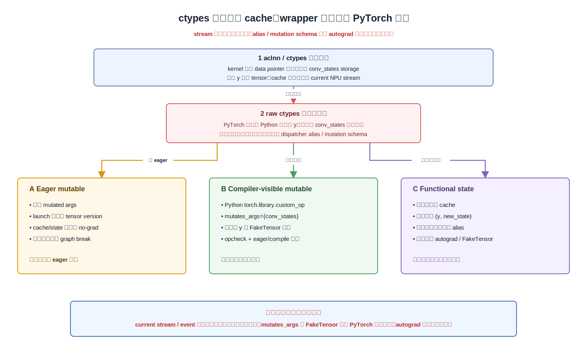
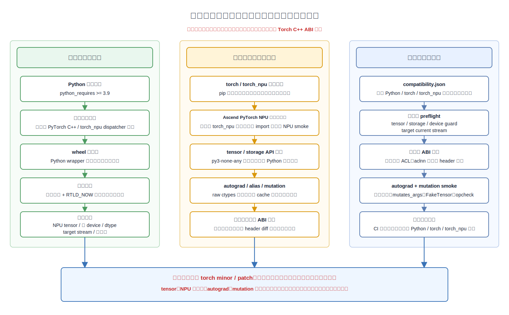

# fla_npu 的 PyTorch / torch_npu 解耦设计

本文回答三个问题：为什么旧交付方式会让 wheel 数量膨胀；`fla_npu` 如何把构建期版本绑定迁移为运行时能力依赖；不再默认使用 `torch_npu` dispatcher 后，原路径提供的易用性和正确性能力如何补回。

本文面向第一次接触自定义算子交付的开发者。**PyTorch**、**torch_npu**、**CANN**、**ABI**、**ELF**、**dispatcher**、**backend**、**mutation** 等术语的通俗解释统一放在[附录 A：依赖基础与术语表](#附录-a依赖基础与术语表)。第一次遇到不熟悉的词，可以先跳到附录查询。

## 1. 我们遇到了什么问题

### 1.1 同一份算子为什么要重复出包

旧方案使用 **PyTorch C++ extension** 和 torch_npu dispatcher 桥接自定义 Ascend C 算子。典型调用链如下：

```text
Python 用户代码
  -> torch.ops.npu.<op>
  -> custom_aclnn_extension_lib*.so
  -> libtorch / ATen / c10 / libtorch_npu
  -> libcust_opapi.so 中的 aclnn* 接口
  -> CANN runtime
  -> NPU kernel
```

`custom_aclnn_extension_lib*.so` 是这条链路的 ABI 汇合点。它由 `CppExtension` 编译，包含 op-plugin 生成的参数适配和 dispatcher 注册代码，并在编译或加载时依赖以下环境：

| 被绑定的环境 | 为什么会绑定 | 环境变化后的常见结果 |
| --- | --- | --- |
| Python minor 版本 | CPython extension 带 `cp39`、`cp310`、`cp311` 等标签和 ABI | wheel 无法安装或扩展无法加载 |
| torch 版本 | 扩展 include/link ATen、c10、libtorch，并使用对应 dispatcher 约定 | `undefined symbol`、schema 注册失败或行为不一致 |
| torch_npu 版本 | 扩展依赖 op-plugin 生成代码、`libtorch_npu.so` 和 NPU dispatcher | 注册失败、符号不匹配或旧补丁行为被带入 |
| gcc / libstdc++ | C++ extension 固化 C++ 标准库 ABI 和编译器符号约定 | `GLIBCXX_* not found` 或 `cxx11abi` 不匹配 |
| host 架构 | ELF 机器码只能在对应 CPU 架构加载 | aarch64 与 x86_64 需要分别构建 |

因此，包数量近似为：

```text
包数量 ~= SoC 数量
        x host 架构数量
        x torch 版本数量
        x torch_npu 版本数量
        x Python minor 版本数量
        x C++ ABI 组合数量
```

例如仅支持 3 种 SoC、2 种 host 架构、5 个 torch 版本和 3 个 Python 版本，理论组合就已达到 90 个；再加入 torch_npu 和 C++ ABI 差异，发布、测试和回归成本会继续扩大。



### 1.2 真正需要解决的不是“有没有依赖”

自定义 NPU 算子不可能完全没有依赖。它仍然需要 torch tensor、NPU 设备管理、CANN runtime 和对应 SoC 的 kernel。真正的问题是：**不应为了调用一个稳定的 C 接口，把构建机器上的整套 PyTorch、torch_npu、CPython 和 C++ ABI 固化进 wheel。**

本仓的目标不是让任意 torch 与任意 torch_npu 自动兼容，也不是用 Python 替代 CANN，而是：

- 默认 wheel 不包含 PyTorch C++ extension。
- 默认构建不读取 torch、torch_npu、CPython extension 或 C++ ABI。
- torch 和 torch_npu 只需在目标环境中共同提供可用的 Ascend PyTorch NPU 运行时能力。
- 通过 Python `ctypes` 调用稳定的 `aclnn*` C 接口。
- 用运行时能力探测和真实测试矩阵证明兼容范围，而不是用构建环境版本号锁死范围。

## 2. 如何完成解耦

### 2.1 核心方法：把依赖放回正确阶段

解耦的核心不是删除依赖，而是把依赖拆成两类：

- **构建期依赖**：生成目标 SoC 的 OPP、op_api 动态库和 wheel 时必须存在。
- **运行期依赖**：用户真正调用算子时，由目标 Python 环境提供。

旧路径在构建期同时引入 CANN、PyTorch、torch_npu、CPython 和 C++ ABI。新路径只在构建期使用 CANN；torch tensor、NPU device、current stream、autograd 和可选图编译能力改为运行时读取。

### 2.2 组件关系和上下游边界

下图把构建期和运行期放在同一张 UML 风格组件图中。实线箭头表示实际调用或产物输入，虚线表示可选能力适配，红色隔离框表示默认构建明确不引入的组件。



图中的关键边界如下：

| 组件 | 上游输入 | 下游输出或调用 | 是否进入默认 wheel 构建 ABI |
| --- | --- | --- | --- |
| CANN 构建工具链 | Ascend C kernel、op_host、tiling、op_api 源码 | OPP vendor 树、`libcust_opapi.so`、kernel object 和配置 | 是 |
| wheel 组装器 | 纯 Python wrapper、Triton Python 源码、OPP vendor 树 | `py3-none-any` wheel | 是，但不编译 CPython/PyTorch extension |
| torch Python tensor API | 目标环境中的 tensor 对象 | data pointer、shape、stride、dtype、device、输出分配 | 否，运行时读取 |
| Ascend PyTorch NPU 运行时能力 | 通常由目标环境中的 torch_npu 提供 | NPU allocator、device guard、current stream 和 NPU tensor 执行能力 | 否，运行时读取 |
| Python ctypes bridge | Python wrapper 整理后的 tensor metadata 和参数 | `aclnn*GetWorkspaceSize` / `aclnn*` C 调用 | 否，纯 Python 调用层 |
| wheel 内嵌 OPP | 构建期生成的 op_api、op_host、tiling 和 kernel | CANN runtime 可发现、可加载的自定义算子 | 作为数据和动态库随 wheel 交付 |
| CANN runtime / driver | aclnn executor、workspace、stream、OPP 注册信息 | 在指定 NPU stream 上 enqueue kernel | 否，由目标机器提供 |
| torch autograd / `torch.library` / compiler | 用户选择的训练或图编译能力 | 可选正反向、schema、FakeTensor 和图捕获 | 否，按需在运行时适配 |

### 2.3 哪些内容不再进入默认构建

| 旧构建步骤 | 新构建步骤 | 解耦效果 |
| --- | --- | --- |
| 运行 torchnpugen / op-plugin 生成 C++ dispatcher 代码 | 默认跳过；仅 legacy 构建显式启用 | 不绑定 torch_npu 生成代码和注册机制 |
| `CppExtension` include/link ATen、c10、libtorch、libtorch_npu | 默认不构建该扩展 | 不绑定 torch minor、torch_npu 和 C++ ABI |
| 生成 `custom_aclnn_extension_lib*.so` 并由 `torch.ops.load_library()` 加载 | 默认 wheel 不需要该文件 | 不绑定 CPython extension ABI |
| wheel tag 携带 `cp311`、平台和 C++ ABI 信息 | Python 层使用 `py3-none-any` tag | 同一 host/SoC wheel 可覆盖多个 Python minor 和已验证框架组合 |
| 每次框架升级重新编译桥接扩展 | 运行时做 capability probe 和测试 | 框架升级不再天然要求重编 OPP wheel |

legacy `torch.ops.npu.*` 兼容路径仍可通过 `FLA_NPU_BUILD_LEGACY_EXTENSION=1` 构建，但它是显式 opt-in，不属于默认解耦交付。

### 2.4 依赖在哪个阶段确定



| 阶段 | 此时确定的内容 | 此时不应确定的内容 |
| --- | --- | --- |
| CANN 构建 | SoC、kernel 二进制、op_host、tiling、op_api C ABI、host 架构 | 目标环境的 torch、torch_npu、Python minor 和 C++ ABI |
| wheel 组装 | 包版本、Python wrapper、Triton 源码映射、内嵌 OPP vendor 树 | torch / torch_npu C++ 头文件和 dispatcher 生成代码 |
| `pip install` | `python_requires`、安装目标 `site-packages`、wheel 内容落盘 | torch 与 torch_npu 是否配套、NPU 是否可执行 |
| `import fla_npu` | OPP root、`libcust_opapi.so` 路径、必需动态符号 | 具体 tensor、device、stream 和 autograd 行为 |
| 首次 Ascend C 调用 | tensor metadata、目标 device、device guard、current stream、workspace、mutation 清单 | 构建机器上的 torch / torch_npu 版本 |
| 首次 autograd / 图编译 | forward/backward 语义、版本计数、可选 `torch.library`、FakeTensor 和 compiler 能力 | torch_npu derivatives 生成和 C++ dispatcher ABI |
| 发布验证 | 声明支持的 Python、torch、torch_npu、host 和 SoC 组合 | 未实际验证的理论兼容组合 |

### 2.5 默认运行时调用链

一次 `from fla_npu.ops.ascendc import op` 调用按以下顺序执行：

1. 公共入口选择 raw ctypes wrapper 或高层 autograd wrapper。
2. wrapper 根据 `aclnn_*.h` 组织参数并分配输出 tensor。
3. runtime 从输出 tensor 确定目标 NPU device，并检查所有输入输出位于同一 device。
4. runtime 进入 `torch.npu.device(target_device)` device guard。
5. runtime 从 tensor 读取 data pointer、shape、stride、dtype、storage offset 和 format，创建 ACL descriptor。
6. ctypes 调用 `<aclnnOp>GetWorkspaceSize(...)`，取得 workspace 大小和 executor。
7. runtime 在目标 device 上分配 workspace。
8. runtime 读取 `torch.npu.current_stream(target_device)` 的底层 stream pointer。
9. ctypes 调用 `<aclnnOp>(workspace, size, executor, stream)`，将 kernel enqueue 到 current stream。
10. runtime 销毁 descriptor，短期保活输出、workspace 和 helper tensor，并在退出 device guard 时恢复调用方原 device。

这条默认链路没有 `torch.ops.load_library()`，不查找 `torch.ops.npu.<op>`，也不加载 `custom_aclnn_extension_lib*.so`。

### 2.6 wheel 中实际交付什么

```text
site-packages/
  fla_npu/
    __init__.py
    ops/
      ascendc/
        __init__.py
        _runtime.py
        _aclnn_ctypes.py
      triton/
        __init__.py
        triton_core/
    opp/
      vendors/
        config.ini
        fla_npu_transformer/
          bin/set_env.bash
          op_api/lib/libcust_opapi.so
          op_api/lib/libopapi.so
          op_impl/ai_core/tbe/op_host/...
          op_impl/ai_core/tbe/op_tiling/...
          op_impl/ai_core/tbe/kernel/...
          op_proto/...
```

`fla_npu` 按以下顺序选择 OPP：

1. 用户显式设置的 `FLA_NPU_OPP_PATH`。
2. wheel 内嵌的 `fla_npu/opp`。
3. `ASCEND_CUSTOM_OPP_PATH` 或 `ASCEND_OPP_PATH` 中唯一匹配的 vendor。

选中后，包会把 vendor root 前置到 `ASCEND_CUSTOM_OPP_PATH`，把 `op_api/lib` 前置到 `LD_LIBRARY_PATH`，并用 `FLA_NPU_OP_API_LIB` 记录实际加载的 `libcust_opapi.so`。

### 2.7 解耦后仍然保留的运行时依赖

| 运行时依赖 | 为什么仍需要 | 如何验证正确性 |
| --- | --- | --- |
| torch Python tensor API | 承载 NPU 内存、shape、stride、dtype、device 和输出 tensor | capability probe + 单算子测试 |
| Ascend PyTorch NPU 运行时能力 | 创建 NPU tensor、分配内存、管理 device 和 current stream | torch / torch_npu 配套 smoke + 多卡测试 |
| ACL / aclrt / aclnn | 创建 descriptor、executor、workspace 并发射算子 | 动态符号检查 + 真实调用 |
| wheel 内嵌 OPP | 提供自定义 op_api、op_host、tiling 和 kernel | 打包完整性检查 + SoC 构建测试 |
| Triton Ascend | 只服务 `fla_npu.ops.triton` 的 JIT 算子 | 独立版本检查 + JIT smoke |

因此，`py3-none-any` 只表示 Python 层没有 CPython extension ABI，不表示 wheel 与所有机器、SoC 或框架组合天然兼容。发布范围仍以真实测试矩阵为准。

## 3. 原路径提供了什么，解耦后少了什么

### 3.1 原组件的职责

| 原组件 | 原本提供的能力 | 解耦后的状态 | 能力类别 |
| --- | --- | --- | --- |
| `custom_aclnn_extension_lib*.so` | 把 torch tensor 转为 aclnn 参数；承接 C++ dispatcher 调用 | 默认不构建；改由 Python ctypes wrapper 完成 | 基础调用 |
| dispatcher schema | 可声明参数、返回值、alias、inplace mutation 和默认值；只有 schema 写准确才生效 | raw ctypes 不会自动获得；需要 wrapper 或 `torch.library` 显式补齐 | 功能正确性 |
| Ascend PyTorch NPU 运行时能力（通常由 torch_npu 提供） | NPU device 注册、allocator、device guard、stream、NPU dispatch key 等运行时能力 | 仍由目标环境提供，但 fla_npu 不默认 import torch_npu，也不链接其 C++ ABI | 功能正确性 |
| torch_npu derivatives / dispatcher autograd | 自动把 forward 和 backward 注册到 autograd | 默认不使用；改由 Python 公共入口绑定 | 易用性 |
| dispatcher 的 FakeTensor / functionalization 接入 | 帮助 `torch.compile`、`torch.export` 和图变换理解算子 | raw ctypes 默认缺失；按需增加 Python `torch.library` adapter | 易用性 + 正确性 |
| dispatcher autocast / vmap 注册 | 自动混合精度和向量化批处理扩展点 | 默认缺失；有需求的算子按需注册 | 易用性 |
| torch ops 命名空间 | `torch.ops.npu.<op>` 统一调用入口 | 仅保留 legacy opt-in；推荐 `fla_npu.ops.ascendc.<op>` | 易用性 |
| CANN op_api / OPP | aclnn 两段式接口、op_host、tiling、kernel 注册和执行 | 完整保留并随 wheel 交付 | 基础调用 + 正确性 |

### 3.2 两类能力要用不同方法补回

**易用性能力**解决“用户是否容易调用”：

- 稳定 import 路径。
- forward/backward 自动绑定。
- legacy API 迁移提示。
- 可选 `torch.compile`、`torch.export`、autocast 和 vmap 集成。

这些能力主要在 Python 公共入口或可选 `torch.library` adapter 中恢复，不应为了方便再次引入 PyTorch C++ extension。

**功能正确性能力**解决“结果和状态是否真的正确”：

- 输入输出 alias 与 inplace mutation 是否对 PyTorch 可见。
- 多卡进程是否选择了正确 device 和 stream。
- 外部异步任务队列是否与 current stream 正确集成。
- workspace、输出和 helper tensor 是否活到 kernel 消费完成。
- NZ 等 ACL 私有格式是否被完整透传。
- ctypes 参数是否与 aclnn C ABI 一致。

这些能力必须由公共 runtime、算子 wrapper、schema 和测试共同保证，不能依靠文档约定或调用方“碰巧正确”。

## 4. 易用性能力如何补回

### 4.1 稳定、可发现的 Python 入口

新代码统一使用：

```python
from fla_npu.ops.ascendc import chunk_fwd_o
from fla_npu.ops.triton import chunk_local_cumsum
```

`fla_npu.ops.ascendc.__init__` 维护公开名字、raw op 和高层 wrapper 的映射。具体 ctypes 签名放在 `_aclnn_ctypes.py`，公共 device/stream/descriptor 逻辑放在 `_runtime.py`，独立算子开发者不需要复制公共 runtime。

### 4.2 自动求导

解耦后不使用 torch_npu derivatives 生成。高层入口通过 Python `torch.autograd.Function` 绑定 forward/backward：

1. raw forward 和 raw backward 都在 `_aclnn_ctypes.py` 中按 aclnn ABI 实现。
2. `BACKWARD_OPS` 记录 forward 与 backward 的对应关系。
3. 高层 wrapper 根据 run mode、optional 参数和 `requires_grad` 判断是否能安全绑定。
4. forward 使用 `save_for_backward` 保存反向真正需要的 tensor。
5. backward 直接调用对应 ctypes backward op，并按 forward 参数数量返回梯度或 `None`。

只有具备明确数学梯度、不会破坏状态语义的模式才能自动绑定。decode、可变状态更新或没有定义梯度的模式必须停留在 raw/eager 路径，不能为了“支持 autograd”伪造 backward。

### 4.3 `torch.compile` 和 `torch.export`

raw ctypes 是 Python 之外的隐藏副作用，不能直接宣称 fullgraph compile/export 安全。需要图编译时，在 ctypes 外增加纯 Python `torch.library.custom_op` 层：

- functional op 使用 `mutates_args=()`，所有返回 tensor 必须是新值。
- mutable op 准确列出 `mutates_args={"cache_name"}`。
- 返回 tensor 的算子注册 FakeTensor 实现。
- 需要训练时注册可追踪的 autograd 公式。
- 使用 `torch.library.opcheck` 检查 schema、FakeTensor、autograd 和 AOT/functionalization 行为。

这会使用 PyTorch 的 Python dispatcher 能力，但不会生成或链接 PyTorch C++ extension，因此不会重新引入 torch/torch_npu C++ ABI 绑定。当前默认 raw ctypes 路径只承诺 eager 行为；完成上述适配和测试的算子才能声明图编译支持。

### 4.4 autocast、vmap 和其他 Python 扩展点

这些能力不是所有算子的默认需求：

- dtype 由算子固定控制时，可以在高层 wrapper 明确转换或注册 autocast rule。
- 算子具备可批处理语义时，可以注册 vmap rule。
- 需要 tensor subclass 或 TorchDispatchMode 时，优先在 `torch.library` 层适配。

每增加一种扩展点，都必须进入对应 torch 版本测试矩阵；不能仅凭注册成功宣称数值和状态语义正确。

### 4.5 legacy 调用兼容

旧用户可以显式调用：

```python
import fla_npu

fla_npu.load_legacy_torch_ops()
```

该函数加载 `custom_aclnn_extension_lib*.so`，注册 `torch.ops.npu.*`，并安装弃用提示。它重新引入 torch_npu dispatcher 和 C++ ABI 依赖，只用于迁移和兼容性测试，不是默认安装后的必需步骤。

## 5. 功能正确性能力如何保证

### 5.1 alias、inplace mutation 和 cache 状态

dispatcher schema 可以用 `Tensor(a!)` 表示某个 tensor 会被原地修改，并通过 alias 标记表达返回值与输入共享 storage。ctypes 直接把 data pointer 交给 kernel 时，PyTorch 无法自动发现这些事实。



wrapper 必须明确选择以下一种语义：

| 语义 | 适用场景 | 正确性要求 |
| --- | --- | --- |
| Functional | 不修改输入，输出为新 tensor | 输出不与输入 alias；需要入图时提供 FakeTensor |
| Eager mutable | cache/state 更新，只要求 eager 推理 | 声明 mutated args；拒绝状态 tensor 求梯度；launch 后推进 version counter；未适配时产生 graph break |
| Compiler-visible mutable | cache/state 更新且需要图编译 | 使用 `torch.library.custom_op` 和准确 `mutates_args`；返回值不隐式 alias 输入；执行 `opcheck` 和 eager/compile 状态对比 |
| Functional state | 训练或导出需要显式状态流 | 不修改输入 cache，返回 `(y, new_state)`；新旧状态不 alias |

当前 `causal_conv1d` 的 `conv_states` 在 prefill、decode 和 speculative 路径中都可能被修改。公共入口通过 `MUTATED_ARGUMENTS` 声明该参数，拒绝 `conv_states.requires_grad=True`，并在 ctypes launch 成功后调用 `torch.autograd.graph.increment_version()`。这补齐了 eager autograd 的版本检查，但不会让 raw ctypes 自动变成 compiler-visible op。

`ctx.mark_dirty()` 只服务正确实现的 `torch.autograd.Function`，不能替代 mutation schema，也不能让 `torch.compile` 看见任意 ctypes 写入。

### 5.2 多卡 device guard

每次 aclnn 调用都遵守以下规则：

1. 从非空输出 tensor 确定目标 NPU device。
2. 所有输入和输出必须位于同一 device；不隐式跨卡拷贝。
3. 在 `torch.npu.device(target_index)` guard 内创建 descriptor、分配 workspace 和 launch。
4. 使用 `torch.npu.current_stream(target_index)`，不使用调用方当前 device 的 stream。
5. 退出 guard 后恢复调用方原 device。

因此，即使线程当前 device 是 `npu:0`，只要输入输出在 `npu:2`，算子也会在 `npu:2` 的 current stream 上执行。跨卡输入必须由调用方提前搬运。

### 5.3 外部异步任务队列与 stream 集成

fla_npu 不给每个算子增加 `stream=` 参数，而是遵循目标 device 的 current stream 约定：

```python
stream = torch.npu.current_stream(target_device)
stream_ptr = int(stream.npu_stream)
```

外部 executor 需要在调用 fla_npu 前，把自己的 ACL stream 设置为目标 device 的 current stream。之后 fla_npu 会把 aclnn kernel enqueue 到同一 stream。

数据依赖分两种情况：

- 同一 stream：依赖 FIFO enqueue 顺序，不需要全局 synchronize。
- 不同 stream：调用方或外部 executor 必须 record/wait event，建立 producer-consumer 关系。

如果外部框架无法把自己的 stream 暴露为 `torch.npu.current_stream(device)`，应在 `_runtime.py` 增加统一 stream provider 或上下文管理器，不能给每个算子各自增加一套 stream 参数。

### 5.4 异步 launch 的对象生命周期

aclnn launch 返回时，kernel 通常只完成 enqueue。runtime 必须保证：

- 用户输入 tensor 由调用方持有。
- 输出 tensor、workspace 和临时 helper tensor 在设备消费完成前不被 Python GC 回收。
- int-array descriptor 使用的临时 tensor 不提前释放。
- descriptor 在 executor 构造和 launch 完成后销毁。

本仓使用 `_RECENT_LAUNCH_STORAGE` 保存近期输出、workspace 和 helper tensor，不在默认路径做全局 synchronize。这个保活机制解决对象生命周期，不替代跨 stream event。

### 5.5 ACL 私有格式和 NZ 透传

runtime 创建 ACL tensor descriptor 时同时传入：

- 逻辑 shape 和 stride。
- storage offset 和 storage data pointer。
- dtype。
- ACL format。
- storage shape。

wrapper 的原则是“透传描述，不自行解释私有 layout”。默认不得无理由 `.contiguous()`、转置或转成 ND，否则可能破坏 NZ 等私有格式。宿主进程已经加载 torch_npu 时，runtime 可以复用 `torch_npu.get_npu_format()`；未加载时按 tensor 维度回退到保守 format，这只是能力降级，不应把 torch_npu 变成默认 import 依赖。

### 5.6 ctypes 与 aclnn C ABI 一致性

每个 `_aclnn_ctypes.py` wrapper 必须逐项对应 `aclnn_*.h`：

- 参数顺序和 C 类型。
- required / optional / null 语义。
- 属性默认值和字符串生命周期。
- 输出数量、shape、dtype 和 format。
- `<aclnnOp>GetWorkspaceSize` 返回 executor 的生命周期。
- `<aclnnOp>(workspace, size, executor, stream)` 的发射签名。

动态符号能加载不代表参数 ABI 一定正确。同名 aclnn 符号发生不兼容变化时，必须发布新符号或版本化接口；不能修改旧签名后继续宣称旧 wheel 兼容。

## 6. 如何验证、发布和维护

### 6.1 兼容性闭环



当前已经硬检查：

- `python_requires >= 3.9`。
- wheel 内嵌 OPP 和 `libcust_opapi.so` 完整性。
- `RTLD_NOW` 动态加载和必需符号。
- NPU tensor、同 device、dtype、descriptor、workspace 和 launch 返回值。
- `causal_conv1d` mutable state 的 grad 限制和 version counter。

当前仍需测试矩阵证明：

- torch 与 torch_npu 是否属于可用的配套组合。
- tensor/storage Python API 是否跨版本兼容。
- NPU device guard 和 current stream 是否行为一致。
- autograd 梯度是否正确。
- mutable custom op 的 `torch.compile` / functionalization 是否正确。
- Triton Ascend 的 import、JIT 和 launch 是否可用。

推荐在 wheel 内维护 `compatibility.json`，记录已验证版本、所需 Python 能力、NPU runtime 能力和 aclnn 符号；安装后 preflight 做能力探测，CI 根据同一份清单生成版本矩阵。

### 6.2 测试分层

| 测试层 | 证明什么 | 典型检查 |
| --- | --- | --- |
| 纯 Python UT | wrapper 元数据和公共 runtime 逻辑 | device guard、mutation 清单、version counter、错误分支 |
| 动态加载 smoke | wheel 与 OPP 自洽 | OPP 定位、CDLL、aclnn 符号 |
| 单算子 NPU 测试 | C ABI、tiling、kernel 和状态语义 | 输出精度、cache 更新、异常输入、多卡 |
| autograd / gradcheck | 正反向绑定和梯度 | forward/backward、梯度数量、保存上下文 |
| `opcheck` / compile | dispatcher schema 和图变换 | schema、FakeTensor、functionalization、eager/compile 对比 |
| Example/ST | 端到端调用链 | GDN example、不同 SoC、真实 shape 和行为参数 |
| 发布矩阵 | 跨环境复用范围 | Python、torch、torch_npu、host、SoC 组合 |

### 6.3 run 包覆盖 wheel 内嵌 OPP

run 包 `--install` / `--full` 会把 `packages/vendors/fla_npu_transformer` 合并覆盖到当前环境的 `site-packages/fla_npu/opp/vendors/fla_npu_transformer`。覆盖可能同时替换共享 `libcust_opapi.so`、tiling 和 proto，因此安装前必须列出：

- run 包包含的算子。
- 覆盖后仍可使用的算子。
- 因共享库被替换而不可用的算子。
- aclnn header 的 added / modified / removed 变化。

runtime 会缓存 CDLL 和符号，并使用 `RTLD_NODELETE`。覆盖 OPP 后必须重启 Python 进程，不能期待当前进程自动卸载旧 so。

### 6.4 修改红线

- 默认 import 或默认算子调用不得主动 import `torch_npu`。
- 默认 wheel 不得重新引入 `CppExtension`、`BuildExtension` 或 `torch.ops.load_library()`。
- 不得把 `torch.ops.npu` 作为新代码推荐入口。
- 不得通过 ctypes 修改输入 storage 却不维护 `MUTATED_ARGUMENTS`、version counter 和 grad 限制。
- 未注册准确 `mutates_args`、FakeTensor 并通过 `opcheck` 前，不得宣称 mutable op 支持 `torch.compile` / `torch.export`。
- 不得在 wrapper 中无说明地 `.contiguous()` 可能承载 NZ 的输入。
- 不得按 torch patch 版本散落条件分支；能力差异应集中在 runtime provider 或 adapter。
- 修改 device guard、stream、异步保活、format、mutation 或 autograd 行为时，必须同步本文和对应测试。

## 7. 常见问题

### 是否完全不依赖 torch？

不是。默认路径仍使用 torch Python tensor，并使用 torch autograd、device 和 stream Python API。解耦的是 PyTorch C++ extension ABI，而不是 torch tensor 本身。

### 是否完全不依赖 torch_npu？

fla_npu 默认不会主动 import、链接或注册 torch_npu dispatcher；目标环境仍需提供 Ascend PyTorch NPU 运行时能力，通常由 torch_npu 完成 NPU backend 初始化后暴露给 torch。

### 为什么一个 wheel 可以覆盖多个 torch 和 Python 版本？

因为默认 Python 调用层没有 CPython/PyTorch C++ extension，wheel tag 是 `py3-none-any`；torch 差异由运行时 Python capability probe 和测试矩阵处理，而不是编译进 `custom_aclnn_extension_lib*.so`。

### `py3-none-any` 是否表示与 CPU 架构和 SoC 无关？

不是。tag 只描述 Python 层兼容性。wheel 内仍包含 host ELF 和目标 SoC kernel，因此发布文件名和测试矩阵仍需区分 aarch64/x86_64 以及 910B、910_93、950。

### 不使用 dispatcher 会不会少功能？

会失去 dispatcher 自动提供的 schema、alias/mutation、FakeTensor、functionalization、autocast、vmap 和 dispatcher autograd 注册。基础 eager 调用不需要全部补齐；有状态更新的算子必须先补正确性契约，需要训练或图编译的算子再补对应 Python adapter。

### 为什么不把 stream 作为每个算子的参数？

目标 device 的 current stream 是统一约定。把 stream 管理集中在 runtime，外部 executor 只需设置 current stream；这样可以避免每个算子维护不同 stream 参数和多卡行为。

## 附录 A：依赖基础与术语表

### A.1 先理解五类依赖

| 依赖类型 | 通俗解释 | 本仓示例 |
| --- | --- | --- |
| 源码依赖 | 编写代码时引用了另一个模块的源码或头文件 | CANN op_api 头文件、Ascend C API |
| 构建依赖 | 只有编译/打包时需要，产物生成后不一定需要 | CANN compiler、CMake、wheel builder |
| 链接依赖 | ELF 在加载时必须找到另一个动态库及其符号 | 旧扩展对 libtorch、libtorch_npu、libstdc++ 的依赖 |
| 运行时能力依赖 | 不要求构建版本相同，但运行时必须提供某项行为 | torch tensor、NPU device guard、current stream |
| 语义依赖 | 接口名字相同，但行为、状态或数据解释必须一致 | mutation、alias、dtype、layout、autograd 语义 |

“版本号相同”只是判断兼容性的一种粗粒度办法；更可靠的方法是明确需要的 ABI、API 和语义，再通过 capability probe 与真实测试验证。

### A.2 术语解释

| 术语 | 小白解释 | 在本设计中的位置 |
| --- | --- | --- |
| PyTorch / torch | 提供 tensor、自动求导、设备抽象和编译器的 Python 深度学习框架；本文中两者指同一框架 | 运行时提供 tensor、autograd 和可选 compiler 能力 |
| torch_npu | 让 PyTorch 能使用昇腾 NPU 的扩展包 | 通常提供 Ascend PyTorch NPU 运行时能力；默认不参与 fla_npu 构建和 dispatcher 注册 |
| CANN | 昇腾计算架构的软件栈，包含编译器、ACL、runtime、算子开发和执行组件 | 构建 OPP，并在目标机器运行 aclnn/kernel |
| NPU | Neural Processing Unit，面向神经网络计算的加速设备 | 真正执行 Ascend C 或 Triton kernel |
| SoC | System on Chip，芯片型号/代际 | 决定 kernel 编译目标，例如 910B、910_93、950 |
| host | 运行 Python 和发起 NPU 任务的 CPU 侧系统 | 需要区分 aarch64 和 x86_64 ELF |
| API | Application Programming Interface，源码层面如何调用一个功能 | Python 函数签名、`aclnn*` 函数签名 |
| ABI | Application Binary Interface，已经编译好的二进制之间如何交换参数、调用符号和解释内存 | 旧 C++ extension 必须与 torch/torch_npu/C++ ABI 一致 |
| ABI 一致性 | 两个二进制对参数宽度、顺序、类型布局、符号和调用约定的理解完全相同 | ctypes 声明必须逐项匹配 `aclnn_*.h` |
| ELF | Linux 上常见的可执行文件和动态库格式 | `.so`、host 可执行文件和部分 kernel 产物的容器格式 |
| `.so` / 动态库 | 运行时加载的共享二进制库 | `libcust_opapi.so`、旧 `custom_aclnn_extension_lib*.so` |
| 动态符号 | 动态库对外暴露或需要解析的函数/变量名字 | `aclnnXxxGetWorkspaceSize`、`aclnnXxx` |
| `DT_NEEDED` | ELF 中记录“加载我时还需要哪些动态库”的条目 | 旧扩展会记录 libtorch、libtorch_npu 等依赖 |
| RPATH | ELF 中帮助动态加载器寻找依赖库的路径信息 | 旧扩展加载问题的常见来源之一 |
| CPython ABI | Python 官方解释器的 C 扩展二进制约定 | 产生 `cp39`、`cp310`、`cp311` 等版本绑定 |
| C++ ABI / cxx11abi | C++ 类型、符号修饰和标准库对象在二进制层的约定 | 旧 C++ extension 可能因 gcc/libstdc++ 差异无法加载 |
| libstdc++ | GCC 常用的 C++ 标准库实现 | 提供 `GLIBCXX_*` 符号，旧扩展需要版本匹配 |
| libtorch / libtorch_npu | libtorch 是 PyTorch 的 C++ 运行库；libtorch_npu 是昇腾 NPU 适配中的 C++ 运行库 | 旧 C++ extension 加载时需要匹配它们的版本和符号；默认 ctypes 路径不链接它们 |
| wheel | Python 的可安装发布包，扩展名为 `.whl` | 一键编包的最终交付件 |
| wheel compatibility tag | wheel 文件名中描述 Python、ABI 和平台兼容范围的标签 | `py3-none-any` 表示 Python 层没有 CPython extension ABI |
| `site-packages` | 当前 Python/conda 环境安装第三方包的目录 | wheel 安装后的 `fla_npu` 和内嵌 OPP 所在位置 |
| build time / 构建期 | 编译和组装发布包的阶段 | 新架构只要求 CANN，不读取 torch C++ ABI |
| runtime / 运行期 | 用户 import 并真正调用算子的阶段 | 此时读取 torch tensor、device、stream 和 CANN runtime 能力 |
| dispatcher | PyTorch 根据算子名、设备和 dispatch key 选择具体实现的分发系统 | 旧 `torch.ops.npu` 依赖它；默认 ctypes 路径绕过它 |
| schema | dispatcher 对算子参数、返回值、默认值、alias 和 mutation 的结构化声明 | `torch.library` 适配必须准确提供 |
| dispatch key | PyTorch dispatcher 用来区分 CPU、CUDA、NPU、Autograd 等实现类别的键 | Ascend PyTorch NPU 运行时能力会提供 NPU 相关 key |
| backend | 某种设备在 PyTorch 中的运行时实现集合，不只是一个 kernel；包含设备注册、内存、stream 和 dispatch 等能力 | 本文统一称“Ascend PyTorch NPU 运行时能力”，通常由 torch_npu 提供 |
| op-plugin | torch_npu 中用于生成/适配 PyTorch 算子注册代码的一套机制 | 旧扩展构建依赖；默认解耦构建不使用 |
| ATen / c10 | PyTorch C++ tensor、算子和基础运行时库 | 旧 C++ extension include/link 的主要组件 |
| `CppExtension` | PyTorch 提供的 C++/Python extension 构建工具 | 旧路径生成 dispatcher 桥接 `.so`；默认路径禁用 |
| `custom_aclnn_extension_lib*.so` | 旧路径中的 PyTorch/torch_npu dispatcher 桥接库 | 注册 `torch.ops.npu.*`，是多层 ABI 汇合点，不是 kernel 本身 |
| ctypes | Python 标准库中直接调用 C 动态库函数的机制 | 默认路径用它调用 `libcust_opapi.so` 中的 aclnn 符号 |
| C ABI | C 函数在二进制层的参数、返回值和调用约定 | 比 PyTorch C++ ABI 更窄、更稳定，但仍必须严格匹配 |
| binding / wrapper / adapter | 把一种接口转换成另一种接口的小层；binding 偏底层绑定，wrapper 偏包装，adapter 偏兼容不同能力 | `_aclnn_ctypes.py` 是 binding，公共入口是 wrapper，版本差异放 adapter |
| raw op / raw wrapper | 只完成参数整理和底层调用、不自动补 autograd 或图编译语义的原始入口 | `_aclnn_ctypes.py` 中的函数属于 raw wrapper |
| ACL | Ascend Computing Language，CANN 对设备、tensor descriptor 和算子调用提供的接口层 | runtime 用它创建 tensor/int-array descriptor |
| aclrt | ACL 的 runtime 子接口，负责设备、stream、内存等运行时能力 | aclnn 最终在 aclrt stream 上 enqueue kernel |
| aclnn | CANN 面向神经网络算子的 C 接口族 | fla_npu 默认调用的稳定底层接口 |
| 两段式 aclnn | 先取 workspace/executor，再用 workspace/executor/stream 发射算子 | `GetWorkspaceSize` + 正式 `aclnnOp` 调用 |
| executor | `GetWorkspaceSize` 返回的 opaque 执行计划对象 | 只能交给配套的同一 aclnn/runtime 调用链 |
| workspace | 算子执行时临时使用的 NPU 内存 | runtime 在目标 device 上按返回大小分配 |
| opaque | 调用方只保存指针、不解释内部结构 | `aclTensor`、`aclOpExecutor` 等由 CANN 创建和销毁 |
| tensor | 带 dtype、shape、device 和 storage 的多维数据对象 | Python 与 NPU 内存之间的主要载体 |
| storage / data pointer | tensor 底层实际内存及其地址 | ctypes 用 data pointer 构造 ACL descriptor |
| storage offset | tensor 逻辑起点相对底层 storage 首地址的元素偏移 | 构造 ACL descriptor 时必须传入，避免切片 tensor 指向错误位置 |
| shape / stride | shape 是各维长度；stride 是每维移动一步跨过多少元素 | 共同描述 tensor 的逻辑视图 |
| dtype | 每个元素的数据类型，例如 fp16、bf16、int64 | 必须与 aclnn 和 kernel 支持范围一致 |
| layout / format | 数据各维和底层块如何排列 | ND 是普通连续描述，NZ 是昇腾私有分块格式 |
| OPP | Operator Package，CANN 可发现的自定义算子交付目录 | 包含 op_api、op_host、tiling、proto、kernel 和配置 |
| vendor tree | OPP 中以厂商/项目名组织的一棵目录 | 本仓使用 `fla_npu_transformer` vendor |
| op_api | 对外提供 aclnn C 函数的 host 侧实现 | 编译为 `libcust_opapi.so` |
| op_host | host 侧算子定义、shape 推导、参数校验和注册代码 | CANN runtime 在发射前使用 |
| tiling | 根据输入和硬件把任务切成 kernel 可执行小块，并生成 tiling data | 位于 OPP host 组件，影响正确性和性能 |
| kernel | 在 NPU AI Core 上真正执行计算的程序 | 按目标 SoC 编译并随 OPP 交付 |
| `libcust_opapi.so` | 本仓自定义 op_api 动态库 | 提供 `aclnn*GetWorkspaceSize` 和 `aclnn*` 符号 |
| device | 一个具体计算设备，例如 `npu:0` | 多卡调用必须保证 tensor、guard、workspace 和 stream 属于同一 device |
| device guard | 临时切换当前设备并在退出后恢复的作用域 | 防止多卡调用在错误设备上分配或发射 |
| allocator | 管理设备内存申请、复用和释放的组件 | 通常由 Ascend PyTorch NPU 运行时能力提供 |
| stream / current stream | stream 是设备异步任务队列；current stream 是当前上下文默认入队位置 | fla_npu 把 aclnn kernel enqueue 到目标 device 的 current stream |
| enqueue | 把任务放入异步队列，不表示任务已经执行完成 | aclnn launch 返回后仍需保证对象生命周期 |
| FIFO | First In First Out，同一 stream 中先入队任务先执行 | 保证同 stream 的数据依赖顺序 |
| event | 跨 stream 建立完成通知和等待关系的同步对象 | 不同 stream 的 producer/consumer 必须显式 record/wait |
| producer / consumer | producer 产生数据或任务，consumer 等待并使用它 | 跨 stream 时用 event 明确二者先后关系 |
| asynchronous / 异步 | host 发起任务后立即返回，设备稍后执行 | 需要 workspace/helper tensor 保活，不能随意释放 |
| Python GC | Python 自动回收不再被引用对象的机制 | 异步 kernel 消费前不能让临时 tensor 被 GC 回收 |
| autograd | PyTorch 自动求导系统 | 高层 wrapper 用 forward/backward 绑定实现 |
| forward / backward | forward 计算输出；backward 根据输出梯度计算输入/参数梯度 | `BACKWARD_OPS` 维护对应关系 |
| derivatives | 描述一个 forward 算子应如何计算 backward 的导数规则 | 旧路径可由 torch_npu 生成/注册；新路径在 Python wrapper 中显式绑定 |
| alias | 两个 tensor 或返回值共享同一底层 storage | schema 必须声明，否则图变换可能错误复制或重排 |
| mutation | 操作修改已有对象或 storage，而不是只返回新值 | cache 更新是典型 mutation |
| inplace | mutation 的常见形式，直接修改传入 tensor | schema 常用 `Tensor(a!)` 表示 |
| `mutates_args` | `torch.library.custom_op` 中列出哪些参数会被修改的字段 | 必须与 ctypes/kernel 真实写入完全一致 |
| version counter | PyTorch 为 tensor 维护的修改次数，用于 autograd 检查保存值是否被改写 | ctypes 修改后需调用 `increment_version` 补记 |
| `increment_version()` | 主动推进 tensor version counter 的 Python API | ctypes 成功修改状态 tensor 后调用，让 autograd 看见这次修改 |
| `ctx.mark_dirty()` | `autograd.Function` 告知 autograd“某个输入会被原地修改”的 API | 只适用于正确实现的 `autograd.Function`，不能替代 dispatcher mutation schema |
| `MUTATED_ARGUMENTS` | 本仓维护的 raw ctypes mutable 参数清单 | 当前声明 `causal_conv1d.conv_states` |
| functional op / functional state | 不修改输入，而是返回新的输出/状态 | 最容易被 autograd、导出和图编译正确理解 |
| eager mode | Python 调用到哪里就立即执行到哪里的普通运行模式 | 默认 raw ctypes 路径首先保证 eager 正确性 |
| graph break | 编译器无法安全捕获某段代码时结束当前图，回到 Python eager 执行 | 未适配的 ctypes side effect 应明确 graph break |
| `torch.library` / custom op | 用 Python 注册 PyTorch 算子 schema、实现和扩展规则的 API | 可在不构建 C++ extension 的前提下补 compiler-visible 语义 |
| FakeTensor | 只携带 shape、dtype、device 等 metadata，不分配真实数据的 tensor | 编译器用它推导 custom op 输出 |
| functionalization | 把 mutation 程序转换成等价 functional 程序的图变换 | 必须知道准确 alias/mutation schema |
| `torch.compile` | 把 PyTorch Python 程序捕获并优化成计算图的能力 | raw ctypes 默认不保证 fullgraph 支持 |
| `torch.export` | 把 PyTorch 程序导出为更稳定图表示的能力 | custom op 需要 schema 和 FakeTensor |
| `opcheck` | PyTorch 检查 custom op schema、FakeTensor、autograd 和编译行为的工具 | compiler-visible adapter 的必测项 |
| autocast | 自动按混合精度策略转换浮点输入的机制 | 需要时在 Python custom op 层注册规则 |
| vmap | 自动把单样本函数向量化到批量维度的机制 | 只有定义了批处理语义的算子才应注册 |
| JIT | Just-In-Time，运行时根据实际环境即时编译 | Triton 算子在目标环境进行 JIT |
| Triton Ascend | 面向昇腾的 Triton Python/JIT 编程和运行能力 | 只影响 `fla_npu.ops.triton`，与 Ascend C OPP 分层 |
| capability probe | 不看版本字符串，直接检查某个 API/行为是否存在 | 用于适配 torch storage、device、stream 等差异 |
| preflight | 真正执行任务前的一次集中环境检查 | 提前报告缺失 tensor/NPU/aclnn 能力 |
| legacy | 为旧用户暂时保留、但不推荐新代码继续使用的兼容路径 | `load_legacy_torch_ops()` 和 `torch.ops.npu.*` |
| Python minor 版本 | Python 版本号中的次版本，例如 3.9、3.10、3.11 | CPython C extension 通常不能跨 minor 版本直接复用 |
| CPU / aarch64 / x86_64 | CPU 是 host 处理器；aarch64 和 x86_64 是两类常见 CPU 指令集架构 | host ELF 必须按架构分别构建 |
| gcc | Linux 常用的 C/C++ 编译器 | 旧 C++ extension 的 ABI 和 libstdc++ 版本可能受它影响 |
| CMake | 组织 C/C++/Ascend C 编译规则和依赖关系的构建工具 | 调用 CANN 工具链生成 OPP 产物 |
| compiler / 编译器 | 把源码转换成目标机器或设备可执行产物的程序 | host compiler 生成 `.so`，Ascend C compiler 生成 SoC kernel |
| C++ extension | 让 Python 加载 C++ 机器码的扩展模块 | 旧路径使用；默认解耦路径不构建 |
| torchnpugen | torch_npu 相关的算子适配代码生成工具 | 旧 dispatcher 扩展可能依赖；默认构建跳过 |
| descriptor | 对 tensor 或 int-array 的形状、类型、地址等信息的 C 侧描述对象 | ctypes runtime 调用 ACL 创建并在 launch 后销毁 |
| int-array | 由一组整数构成的 aclnn 参数对象 | 用于传递变长序列索引等属性 |
| metadata | 描述数据的数据，例如 shape、dtype、device，而不是 tensor 的数值内容 | wrapper 和 FakeTensor 都主要处理 metadata |
| proto / config | proto 描述算子注册原型；config 记录 kernel、SoC 和加载配置 | 都属于 OPP vendor 树的一部分 |
| object / object file | 源码编译后的中间或设备目标文件 | OPP 中的 kernel object 由目标 SoC 编译产生 |
| `requires_grad` | tensor 是否要求 autograd 计算梯度的标志 | mutable cache 默认必须为 `False` |
| `save_for_backward` | `autograd.Function` 保存反向阶段所需 tensor 的标准方法 | 高层 wrapper 用它连接 forward/backward |
| gradcheck | 用数值微分检查 autograd 梯度公式的工具 | 与 `opcheck` 分工：前者查数学梯度，后者查 custom-op 注册契约 |
| tensor subclass | 用户基于 torch tensor 扩展出的特殊 tensor 类型 | 需要 dispatcher 或 `torch.library` 规则才能完整支持 |
| TorchDispatchMode | 临时拦截和改写 PyTorch dispatcher 调用的 Python 机制 | raw ctypes 默认不可见，需要 custom-op 适配 |
| AOT | Ahead-Of-Time，在实际执行前提前捕获或编译计算图 | `opcheck` 会检查 custom op 的 AOT/functionalization 行为 |
| fullgraph | 要求 `torch.compile` 把整个函数捕获为一个图、不允许 graph break 的模式 | 未适配 ctypes side effect 的算子不能宣称支持 |
| CDLL | ctypes 对一个已加载 C 动态库的 Python 对象 | runtime 缓存它以复用 `libcust_opapi.so` 符号 |
| `RTLD_NOW` | 加载动态库时立即解析依赖符号的模式 | 让缺库或缺符号尽早失败 |
| `RTLD_NODELETE` | 进程内不真正卸载动态库映射的模式 | run 包覆盖后必须重启 Python 才能可靠使用新 so |
| helper tensor | wrapper 为传参临时创建、用户通常看不到的 tensor | 异步 launch 时也必须保活 |
| manifest / `compatibility.json` | 机器可读的发布清单，记录版本、能力和必需符号 | 可用于 preflight 和 CI 生成兼容矩阵 |
| version matrix / 版本矩阵 | 把 Python、torch、torch_npu、host、SoC 等组合列成测试表 | 只有真实通过的组合才属于发布支持范围 |
| smoke test | 用最小输入确认安装、加载和基本调用链可工作的快速测试 | 先于全量精度和端到端测试执行 |
| UT | Unit Test，针对一个函数或模块的单元测试 | 验证 device guard、mutation 元数据等纯 Python 逻辑 |
| ST | System Test，验证多个模块组成的完整系统路径 | Example/ST 验证 GDN 端到端链路 |
| opt-in | 默认关闭，用户必须显式打开的可选能力 | legacy dispatcher 构建和加载属于 opt-in |
| UML | Unified Modeling Language，用标准化图形表达组件、依赖和调用关系的方法 | 本文组件图借用 UML component diagram 的表达方式 |
| conda 环境 | 一套彼此隔离的 Python 解释器和第三方包安装目录 | wheel 安装到当前激活环境的 `site-packages` |
| driver / 驱动 | 连接用户态 runtime 与实际 NPU 设备的软件层 | CANN runtime 通过驱动提交设备任务 |
| side effect / 副作用 | 函数除返回值外还修改了外部可观察状态 | ctypes 修改 cache 是编译器必须知道的副作用 |
