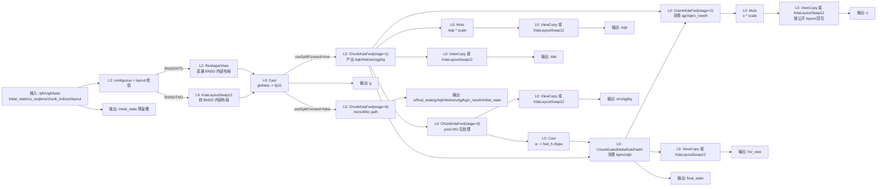

# Kimi Delta Attention（KDA）正向 AscendC 算子设计

## 1. 范围

本文档说明本代码合入请求（Pull Request, PR）中 KDA 正向算子的实现设计。目标是提供一套支持 `gk` 的 AscendC 算子栈，并在语义完全一致的地方复用已有 Gated DeltaNet（GDN）正向状态传播逻辑。

当前 PR 范围：

- 新增 KDA 正向 `ChunkKdaFwd` AscendC 算子内核/算子接口层（L0/L2）算子。
- 新增辅助算子 `KdaLayoutSwap12` 和 `KdaGateCumsum`。
- 为 `ChunkGatedDeltaRuleFwdH` 增加可选 `gk` 入参，因为 KDA 复用 GDN 的状态传播。
- 新增 PyTorch 自定义接口 `npu_chunk_kda_fwd` 和参考测试。
- 验证 `K=128, V=128, chunk_size=64` 下 dense batch-sequence-head-dim/token-head-dim（BSND/TND）兼容输入，以及 batch-head-sequence-dim/head-token-dim（BNSD/NTD）直通性能布局。

不在当前 PR 范围：

- KDA 反向算子。
- `V=256` 性能模板。`V=256` 应使用独立模板，因为统一缓冲/一级缓存（UB/L1）预算和 cube tiling 与 `V=128` 不同。
- 高吞吐的非 chunk 对齐变长序列（varlen）非完整 chunk（partial chunk）路径。公开对外接口（Application Programming Interface, API）保留 `cu_seqlens` 和 `chunk_indices`，但高 `K/V` 非 chunk 对齐 varlen 需要专门的 partial chunk 同步路径，验证完成前不应宣称已优化。

## 2. 对标语义

实现对齐三方对标实现 fla-org 的 KDA 正向分解：

```text
Aqk[i, j] = tril(q_i * k_j * exp2(g_i - g_j)) * scale
Akk       = inv(I + tril(k_i * k_j * exp2(g_i - g_j) * beta_i, -1))
w         = Akk @ (k * beta * exp2(g))
u         = Akk @ (v * beta)
v_new     = u - w @ h_prev
h_next    = exp2(g_last) * h_prev + kg_state @ v_new
o         = qg @ h_prev * scale + Aqk @ v_new
```

其中：

- `gk` 是 log2 空间下 key gate 的累积值。
- `qg` 是 `q * exp2(gk)` 的中间张量。
- `kg` 不是 `gk` 的笔误，而是 key-gated k 中间张量。kernel 中保存的 `kg = k * exp2(-gk)`；状态更新时结合当前 chunk 的 `g_last` 后，数学上等价于 `kg_state = k * exp2(g_last - gk)`。
- AscendC 向量流水（vector pipe）中使用 `exp(x * ln2)` 实现 `exp2(x)`。
- `final_state` 遵循三方对标实现和 GDN 语义，固定为 `float32`，即使 `q/k/v/o` 是 16 位浮点（fp16）或 Brain Floating Point 16（bf16）。

### 2.1 Gate Cumsum 语义

`KdaGateCumsum` 负责把模型侧 raw gate 转成 KDA 主算子消费的 `gk`。当 `use_gate_in_kernel=false` 时，输入 `g` 已经是 step gate，kernel 仅做 chunk 内 log2 空间累加：

```text
gk[b, t, hv, d] = cumsum(g[b, t, hv, d] * rcp_ln2, within_current_chunk)
```

当 `use_gate_in_kernel=true && safe_gate=true` 时，对齐三方对标实现的 safe gate raw path：

```text
x       = (g_raw + dt_bias[hv, d]) * exp(A_log[hv])
gate    = lower_bound * sigmoid(x)
gk      = cumsum(gate * rcp_ln2, within_current_chunk)
```

注意事项：

- `gk` 是 chunk 内累积，不跨 chunk 继续累加。`g_i - g_j` 的使用范围在 chunk 内，因此合法 `gk` 在同一 chunk 内应整体单调不增，且 causal 下 `g_i - g_j <= 0`。
- `safe_gate` 下每步 gate 位于 `[lower_bound, 0]`。默认 `lower_bound=-5` 时，一个 `chunk_size=64` 的 chunk 内 `gk` 可能到 `-300~-460`，这是合法值域。
- 如果某个 chunk 尾行被错误写成 0，会出现 `g_i - g_j` 正跳几百，随后 `exp2(g_i - g_j)` 溢出或产生极大中间值。这类问题的根因通常在 `KdaGateCumsum` 或同步/写回生命周期，不应先通过收紧输入 range、把 cube 改成 scalar 或调阈值规避。
- `safe_gate` 不应作为 AIV 热路径 runtime 分支，也不应依赖 tiling key 组合编码。`KdaGateCumsum` 参考 GDN 入口方式：host tiling 写入 `dataType/safeGate` 字段，kernel 入口选择 `<T, SAFE_GATE>` 模板实例，具体计算路径由编译期常量裁剪。

定位 gate cumsum 问题时，应先使用 gate-only 对比，而不是直接看 `o/final_state`：

```python
gk_npu = fla_npu.ops.ascendc.kda_gate_cumsum(
    g_raw, chunk_size,
    A_log=a_log,
    dt_bias=dt_bias,
    use_gate_in_kernel=True,
    safe_gate=True,
    lower_bound=-5.0,
    layout="BSND",
)
gk_ref = reference_safe_gate_chunk_cumsum(g_raw, a_log, dt_bias, chunk_size)
torch.testing.assert_close(gk_npu.cpu(), gk_ref.cpu(), rtol=2e-3, atol=2e-3)
```

## 3. 对外接口

PyTorch API：

```python
torch.ops.npu.npu_chunk_kda_fwd(
    q,
    k,
    v,
    gk,
    beta,
    scale,
    chunk_size,
    *,
    layout="BSND",
    initial_state=None,
    output_final_state=False,
    cu_seqlens=None,
    chunk_indices=None,
    return_intermediate=False,
    safe_gate=False,
    transpose_state_layout=False,
)
```

`layout` 是显式字符串参数，只接受全大写 `BSND`、`BNSD`、`TND`、`NTD`。默认值为 `BSND`，非 BSND 输入必须显式传入对应 layout；不再根据 shape 自动推导 layout。

支持的内存排布（layout）语义：

- BSND：`q/k: [B, T, H, K]`，`v: [B, T, HV, V]`，`gk: [B, T, HV, K]`，`beta: [B, T, HV]`。
- BNSD：`q/k: [B, H, T, K]`，`v: [B, HV, T, V]`，`gk: [B, HV, T, K]`，`beta: [B, HV, T]`。
- TND：`q/k: [T, H, K]`，`v: [T, HV, V]`，`gk: [T, HV, K]`，`beta: [T, HV]`。
- NTD：`q/k: [H, T, K]`，`v: [HV, T, V]`，`gk: [HV, T, K]`，`beta: [HV, T]`。

其中 `B/T/H/HV/K/V` 分别表示 batch、token 序列长度、query/key head 数、value head 数、key 维度和 value 维度。

BNSD 和 NTD 是性能布局，适用于上游 causal conv 已经完成数据排布转换的流水线。BSND 和 TND 是兼容布局，进入 kernel 前通过 `KdaLayoutSwap12` 转成内部布局。

当前 TND 兼容布局仅支持 `H=1` 的 rank3 输入。多 K head 的 rank3 输入必须使用 NTD 性能布局 `[H, T, D]`；host 侧会直接拦截 `layout=TND && H>1`，避免进入 `fwd_h` kernel 后触发非法访存。当前 `H/HV` 均要求不超过 128。

变长序列（varlen）单次调用最多支持 1024 条序列、4096 个 chunk。超过容量时需要在序列边界拆分请求；稳定 Python 入口和 L2 接口都会在下发 kernel 前返回明确的参数错误。空序列仍按 `cu_seqlens` 非递减语义支持，不占用 chunk。

支持的数据类型（dtype）语义：

- `q/k/v/o/Aqk/Akk/w/u/qg/kg/v_new/h`：根据张量角色跟随 `q` 或 `v` 的 dtype，算子注册覆盖 `fp16`、`bf16` 和 32 位浮点（fp32）；其中 `kg` 表示 key-gated k 中间张量，不是 `gk` 输入。
- `g`：对齐三方对标实现的 gate 累积输出槽，当前由输入 `gk` 转为 `fp32` 后返回。
- `gk/beta`：PyTorch 层接受 `fp32` 或 `bf16`，进入 `ChunkKdaFwd` 前统一 cast 到 `fp32`。
- `initial_state/final_state`：固定为 `fp32`。

返回值顺序对齐三方对标实现：

```python
o, final_state, g, Aqk, Akk, w, u, qg, kg, v_new, h, initial_state = \
    torch.ops.npu.npu_chunk_kda_fwd(...)
```

其中 `initial_state` 输出为预留槽。未传入时返回空 tensor；传入时透传输入 `initial_state`，便于后续扩展到更完整的 state 语义。

预留或拦截：

- 当前 PR 中 PyTorch wrapper 拦截 `safe_gate=True`。
- 当前 PR 中 PyTorch wrapper 拦截 `transpose_state_layout=True`。

## 4. L2 组合设计

`aclnn_chunk_kda_fwd.cpp` 中的 L2 实现流程：

1. 将所有输入处理为 contiguous。
2. 校验显式 `layout` 参数和输入 rank/shape 是否一致，不做 layout 自动推导。
3. 对 BNSD/NTD，NTD reshape 为 `[1, HV, T, D]` view 后直接进入 kernel，不触发布局转换。
4. 对 BSND/TND，TND reshape 为 `[1, T, H, D]` 后通过 `KdaLayoutSwap12` 转成 BNSD。
5. 如有需要，将 `gk/beta` cast 到 `fp32`。
6. 校验并进入 split forward 路径。公开接口不再使用 monolithic `stage=0` scalar 路径兜底：
   - `q/k/v` 必须同为 `fp16` 或 `bf16`，`chunk_size=64`。
   - `K * V` 必须同时容纳四个 `64x64` 求逆工作块和 `64 * (K + V)` 的 post-WU cube 输入。
   - 典型主流模型场景 `bf16, K=128, V=128, chunk_size=64` 满足该约束；其他 shape 不满足 cube 模板时由 host 明确拦截。
7. 对 BNSD/NTD，split 路径的临时输出 copy 回相同 layout 的用户输出。对 BSND/TND，将 BNSD 中间结果转回公开输出 layout。

split 路径包含三个 `ChunkKdaFwd` 阶段以及一次 GDN 状态传播：

```text
stage 1: 准备 qg/kg/w/u/Aqk/Akk 输入并求解 chunk 内部项
GDN fwd_h: 使用 kg（key-gated k）、w、u、gk 更新 h/v_new/final_state
stage 2: 计算 output cube 主路径和最终 o 行
stage 3: 启用 post-WU cube 时后处理 w/kg/u
```

这样设计的原因：

- KDA 正向天然分成“chunk 内矩阵项”和“chunk 间状态传播”两类依赖。`Aqk/Akk/w/u/qg/kg` 可以按 chunk 并行准备；`h/v_new/final_state` 依赖前一 chunk 状态，需要复用 GDN 的 `ChunkGatedDeltaRuleFwdH` 串起状态传播；最终 `o` 又依赖已经产出的 `h` 和 `v_new`。
- 如果把全部逻辑塞进一个大 kernel，需要在 `ChunkKdaFwd` 内重新实现 GDN 状态传播和输出后处理，既会重复已有可靠实现，也会把 cube 主路径、向量后处理、跨 chunk 依赖揉在一起，后续维护和定位都更困难。
- 对主流 `bf16, K=128, V=128, chunk_size=64` 场景，矩阵计算量足够大，拆分带来的 L0 调用和临时张量开销可以被 cube/向量主路径收益覆盖。不满足模板约束的 shape 明确报错，不能回落到 scalar/逐元素计算。

### 4.1 Stage 间数据依赖

KDA 正向的核心依赖关系如下：

```text
KdaGateCumsum(raw gate) -> gk

ChunkKdaFwd stage 1:
    输入 q/k/v/gk/beta
    产出 Aqk/Akk/qg/kg/w/u

ChunkKdaFwd stage 3:
    输入 stage 1 scratch
    产出 post-WU 后的 w/u/kg

ChunkGatedDeltaRuleFwdH:
    输入 kg/w/u/gk/initial_state
    产出 h/v_new/final_state

ChunkKdaFwd stage 2:
    输入 qg/Aqk/h/v_new
    产出 o
```

其中无 chunk 间依赖的部分可以按 `B/HV/chunk` 并行，存在 chunk 间依赖的是 `ChunkGatedDeltaRuleFwdH` 内部的状态传播。优化时不能把这两类依赖混在一起：

- `Aqk/Akk/qg/kg/w/u` 准备阶段允许多个 chunk 并行排布。
- `h/v_new/final_state` 状态传播必须尊重 chunk 顺序，除非引入明确的分段 prefix/scan 方案。
- `o` 只有在 `h/v_new` 已经可用后才能计算。

因此当前实现把 stage 拆开，是为了复用已有 GDN 状态传播，并让 cube 主路径和向量准备/后处理有清晰边界。后续如果进一步融合 stage，必须重新证明跨 stage 的生产者-消费者关系、workspace 生命周期和 cross-core flag 计数平衡。

目标 split forward 路径中，L2 对 L0 接口的拼接关系如下。小 shape 或 `fp32` fallback 路径在完成 layout/cast 后不拆 stage，直接调用 `ChunkKdaFwd(stage=0)` 一次性产出同一组输出。



`ChunkGatedDeltaRuleFwdH` 扩展为可接收可选 `gk`。这是 KDA 复用状态传播的最小依赖；除该正向状态传播复用点外，不扩大修改 GDN 算子族。

BNSD/NTD split forward 中，未做最终后处理（raw）的 `o/Aqk/Akk/w/u/qg/kg/v_new/h` 存放在 executor 管理的临时张量里。L2 最后一步使用同 layout 的 `ViewCopy` 写入用户输出。这样可以避免把用户输出张量作为 custom L0 和逐元素 L0 算子（elementwise L0, elewise L0）之间的生产者-消费者中间张量，否则可能触发非法 tiling 或 workspace 推导。

## 5. L0 Kernel 设计

`ChunkKdaFwd` 内部包含向量侧（AI Vector, AIV）和矩阵侧（AI Core/Cube, AIC）两类工作，通过跨核 flag 成对协作。

关键路径：

- Gate 乘积准备：
  - AIV 加载 `q/k/gk` 行。
  - AIV 计算 `qg = q * exp2(gk)`、`w seed = k * exp2(gk)`、`kg = k * exp2(-gk)`。
  - 行输入和输出使用 double-buffer 队列。
- `Aqk/Akk` raw score：
  - 目标 `K>=16` 路径使用 Catlass cube 通用矩阵乘（General Matrix Multiplication, GEMM）。
  - scalar fallback 仅作为非目标 shape 的 correctness fallback，不能作为目标性能路径。
- `Akk` 求逆：
  - 完整 block token 长度（BT）为 64 时，使用 cube 辅助的 blocked matrix-chain iteration。
  - 当前 PR 保留非 MXH 的 MCH + cube 求逆路径，优先保证输出语义和精度闭环。
  - MXH/L0C 驻留融合曾作为性能探索项实现，但在随机 `cu_seqlens` + 非零 `gk` 场景下仍存在尾块精度风险，本轮已下掉，不作为交付路径。
  - 非满 64 的尾块避免读取 64x64 脏数据，输入准备和回写必须只覆盖当前序列有效 token。
  - solve scratch 在状态传播消费 `h` 之前暂存在 `h` workspace slot 中。
- `w/u` 后处理：
  - 完整 `BT=64` 且 `K/V` 对齐时，使用 cube GEMM 计算 `Akk @ w` 和 `Akk @ v_new`。
  - AIV 准备 beta 缩放输入并完成 vector 后处理。
- Output：
  - AIC 计算 `qg @ h` 和 `Aqk @ v_new`。
  - AIV 合并 state contribution 和 local contribution，得到 `o`。

对于 half/bfloat16 且 `K>=16` 的目标路径，tiling 使用完整 AICore block 数启动，确保每个 AIC producer 都有成对的 AIV consumer，反之亦然。这是 cross-core flag 计数保持平衡的必要条件。

### 5.1 AIV/MTE 生命周期

向量 kernel 中常见流水为：

```text
MTE2: GM -> UB
V:    UB vector compute
MTE3: UB -> GM
```

任一 UB buffer 被跨 pipe 复用前，必须表达真实依赖：

```cpp
// GM -> UB 后，V 读取前
DataCopy(ub, gm[offset], len);
SetFlag<HardEvent::MTE2_V>(event0);
WaitFlag<HardEvent::MTE2_V>(event0);

// V 计算后，MTE3 写回前
VectorCompute(ub, ...);
SetFlag<HardEvent::V_MTE3>(event1);
WaitFlag<HardEvent::V_MTE3>(event1);
DataCopy(gm[offset], ub, len);

// MTE3 仍在读 ub 时，V 或 MTE2 不能复用同一 ub
SetFlag<HardEvent::MTE3_V>(event2);
WaitFlag<HardEvent::MTE3_V>(event2);
SetFlag<HardEvent::MTE3_MTE2>(event3);
WaitFlag<HardEvent::MTE3_MTE2>(event3);
```

`KdaGateCumsum` 曾出现过一个典型同步缺口：每行 `acc` 写回 `gk` 后只等待了 `MTE3->MTE2`，没有等待 `MTE3->V`。当同一个 AIV core 写完一个 chunk 的最后一行后继续处理下一个 task，下一 task 开始时 `Duplicate(acc, 0)` 可能覆盖 MTE3 仍在读取的源 UB，导致上一 task 的最后一行被写成 0。

错误模式伪代码：

```cpp
for (task : tasks_on_this_core) {
    Duplicate(acc, 0);
    for (t in chunk) {
        Add(acc, acc, row);
        SetFlag<V_MTE3>(event);
        WaitFlag<V_MTE3>(event);
        DataCopy(gk[t], acc, k);
        SetFlag<MTE3_MTE2>(event);
        WaitFlag<MTE3_MTE2>(event);
        // 缺少 MTE3_V。下一 task 会复用 acc。
    }
}
```

修复模式：

```cpp
DataCopy(gk[t], acc, k);
SetFlag<HardEvent::MTE3_MTE2>(mte3ToMte2Event);
WaitFlag<HardEvent::MTE3_MTE2>(mte3ToMte2Event);
SetFlag<HardEvent::MTE3_V>(mte3ToVEvent);
WaitFlag<HardEvent::MTE3_V>(mte3ToVEvent);
```

现象特征：

- gate-only 对比中，只坏固定 core 负责的 task 尾行，例如前若干 chunk 的 `t=chunk_end-1`。
- 坏值常为 0 或旧 buffer 值；前面行与 CPU reference 基本一致。
- `safe_gate` 大值域下，下游 `Aqk/Akk/w/kg` 出现 `1e23~1e35` 级极大值或 NaN/Inf。
- `o/final_state` 是下游症状，真正第一现场是 `gk` 的逐元素 diff。

回归覆盖要求：

- 至少包含一个 `safe_gate=True`、`K=128`、`chunk_size=64`、task 数大于 AIV core 数的 gate-only 用例。
- 该用例不需要非常长。`T=1536, HV=2, K=128` 已能稳定覆盖“一个 core 连续处理多个 task”的最后一行写回 hazard。
- 不能只跑 `T=40` 这类小 safe-gate 用例，也不能只跑外部已传入 `gk` 的 `chunk_kda_fwd` 主算子。

## 6. 内存与 Layout

L2 内部使用 BNSD，因为该 layout 在 kernel 使用的 head 和 token 维度上读写更连续：

```text
BSND/TND 公开输入 -> KdaLayoutSwap12 -> BNSD 内部张量
BNSD/NTD 直通输入 -> reshape/view     -> BNSD 内部张量
```

状态 layout：

```text
h:           kernel 内为 [B, HV, NT, K, V]
final_state: [seq_num, HV, K, V]，fp32
```

UB 使用原则：

- 全局内存/统一缓冲（GM/UB）搬运使用 `DataCopy` 或 `DataCopyPad`。
- 目标路径避免使用 `GetValue` 和 `SetValue`。
- 复用大块 UB arena 做矩阵和向量 staging。
- `V=128` 和 `V=256` 模板保持独立，因为二者的 UB 驻留和 tile 复用计划不同。

## 7. 验证结果

构建验证：

- `chunk_kda_fwd`、`chunk_gated_delta_rule_fwd_h`、`kda_layout_swap12` 和 `kda_gate_cumsum` custom package 构建通过。

精度验证：

以下验证 shape 中，`H_K/H_V` 表示 key/value head 数。

- 小 shape BSND/TND/BNSD/NTD 单测对齐 `tests/reference/chunk_kda_reference.py` 并通过。
- 目标 sampled BNSD `B=1, H_K=1, H_V=2, T=16384, K=128, V=128, chunk_size=64` 通过：
  - `o`：`max_abs=4.26e-4`，`mean_abs=3.78e-5`。
  - `final_state`：`max_abs=1.09e-3`，`mean_abs=1.45e-5`。
- 目标 sampled BNSD `B=1, H_K=32, H_V=64, T=4096, K=128, V=128, chunk_size=64` 通过：
  - `o`：`max_abs=4.63e-4`，`mean_abs=4.01e-5`。
  - `final_state`：`max_abs=1.21e-4`，`mean_abs=9.68e-6`。
- 目标 sampled NTD `B=1, H_K=1, H_V=2, T=16384, K=128, V=128, chunk_size=64` 通过。
- `KdaGateCumsum` safe-gate 多 task 回归 `B=1, T=1536, H_V=2, K=128, chunk_size=64` 通过：
  - gate-only CPU reference 对比 `bad_count=0`。
  - 最大绝对误差约 `1.5e-4`，处于 `fp32` 累加和向量指数误差可接受范围。
- 极端 safe-gate 模型复现 `B=1, H_K=2, H_V=2, T=131072, K=128, V=128, chunk_size=64, bf16` 的 NPU 路径通过有限值检查：
  - `gk/o/final_state` 全量 finite。
  - 原先由 chunk 尾行错误写 0 引发的 `exp2(g_i - g_j)` 放大链路已消除。

性能验证使用 `msopprof --aic-metrics=BasicInfo`：

- BNSD `B=1, H_K=1, H_V=2, T=16384, K=128, V=128, chunk_size=64`：相关 KDA+GDN 平均耗时 `3.05 ms`；`KdaLayoutSwap12` 次数为 `0`。
- BNSD `B=1, H_K=32, H_V=64, T=4096, K=128, V=128, chunk_size=64`：相关 KDA+GDN 平均耗时 `13.60 ms`；`KdaLayoutSwap12` 次数为 `0`。

已知验证边界：

- 高 `K/V` 的非 chunk 对齐 `cu_seqlens` 已改为由 L2 一次性规范化 chunk 元数据，并通过 tiling 下发紧凑索引；kernel 热点循环不再逐项从 GM 搬运 `int64` 元数据。`T=131072, H_K=H_V=2, K=V=128, chunk_size=64` 的 BF16 模型形状已覆盖非对齐尾块、非空 `initial_state` 和 `initial_state=None`，未再出现 AIV timeout。
- 该紧凑 tiling 元数据路径的单次调用容量为 1024 条序列、4096 个 chunk；更大请求需要按完整序列边界拆分，不能截断单条序列的状态传播。
- 当前 PR 有意不验证 `V=256`。
- `return_intermediate=True` 下的中间量导出仍需单独看护无效区、layout 和 dtype 语义。若 `h` 中间量出现无效区极值，不应直接等价为 `final_state` 错误，需要按公开输出语义和有效区逐项确认。

## 8. 开发与验证闭环

KDA forward 的开发应按“语义 -> 结构 -> 单算子 -> 组合 -> 精度 -> 性能 -> 回归”推进。推荐流程：

1. 先对齐三方对标实现的数学语义，确认 `Aqk/Akk/w/u/qg/kg/v_new/h/o/final_state` 的公式、dtype 和返回顺序。
2. 再对齐本仓可复用 NPU 模块：
   - GDN `ChunkGatedDeltaRuleFwdH` 用于跨 chunk 状态传播。
   - GDN `solve_tri`/MCH 设计用于三角求逆思路。
   - Catlass cube GEMM 用于矩阵主路径。
   - causal conv layout 转换思路用于 BSND/TND 与 BNSD/NTD 的边界设计。
3. 每增加一个 L0/L2 拼接点，先做小 shape reference 对比，再做目标 shape sampled 对比。
4. 出现精度异常时，必须先定位第一处偏差：
   - `gk` 偏：先看 `KdaGateCumsum`。
   - `Aqk/Akk` 偏：先看 gate factorization、mask、solve。
   - `v_new/h/final_state` 偏：先看 GDN 状态传播、initial_state、chunk 顺序。
   - `o` 偏：先看 `qg @ h` 和 `Aqk @ v_new` 两项是否分别对齐。
5. 出现 NaN/Inf 时，不要先改阈值或输入 range。先检查是否存在：
   - causal mask 前已经 `inf * 0 -> nan`。
   - `g_i - g_j` 非法正跳。
   - UB/GM 写回生命周期未闭合。
   - partial chunk 脏行进入 cube/solve。
6. 性能优化只能在精度第一现场明确后进行。目标形状中矩阵类计算必须保持 cube 主路径，不能为了修精度退回 scalar/逐元素循环。
7. 每个已修复问题必须补“能稳定触发该问题”的回归用例，而不是只补更大的随机全量用例。

## 9. 后续扩展计划

建议后续工作：

1. 增加 dedicated partial-chunk varlen 路径，保证每个参与 subblock 的 AIC/AIV flag 计数平衡，并确保 cube 路径不会消费有效 chunk 外的脏行。
2. 增加 `V=256` 模板，明确 UB/L1 驻留计划，而不是拉伸 `V=128` 模板。
3. 将 KDA 反向算子放到独立 PR 中实现，并复用相同的 `gk` 和 state dtype 约定。
4. varlen partial 路径稳定后，补充 race、memory、init 和 sync 内存/同步检查工具（sanitizer）验证。
